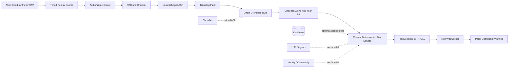
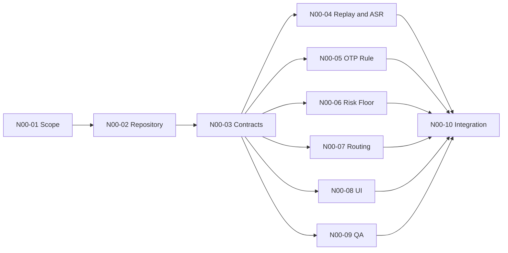

# Namit — Workstream N-00 Complete Responsibility and Implementation Guide

> **Project:** SurakshaCall AI — Privacy-First Scam Call Interceptor  
> **Workstream:** N-00 — Freeze Scope, Architecture, and the First Vertical Slice  
> **Primary owner:** Namit  
> **Target completion:** End of Day 2  
> **Primary success condition:** A synthetic replay WAV produces a visible **CRITICAL** OTP warning through the real event path.  
> **Scope rule:** This workstream proves integration. It does not build the complete classifier, identity directory, community intelligence, multi-agent reasoning, or production database.

---

## 0. Why This Workstream Exists

SurakshaCall AI has six members working on different parts:

- **Odil:** replay audio, microphone, VAD, audio chunking, Whisper, `TranscriptFinal` production;
- **Lakshay:** transcript normalization, direct OTP rule, and `EvidenceEvent` production;
- **Ron:** backend event routing, session state, orchestration, WebSocket delivery;
- **Namit:** shared contracts, minimal deterministic risk decision, hard floor 85, integration acceptance;
- **Palak:** dashboard and visible critical warning;
- **Mayank:** contract review, QA evidence, privacy-safe persistence planning, and test-status tracking.

The greatest early risk is not that one module is technically difficult. The greatest risk is that every member builds a correct module that cannot connect to the others.

Workstream N-00 prevents this by forcing the team to prove one small but real end-to-end flow before adding advanced features.

```text
Synthetic replay WAV
        ↓
Timed audio frames
        ↓
VAD and utterance chunking
        ↓
Local Whisper transcription
        ↓
TranscriptFinal event
        ↓
Direct OTP hard rule
        ↓
EvidenceEvent with risk_floor = 85
        ↓
Minimal deterministic risk service
        ↓
RiskDecision: 85 / CRITICAL
        ↓
Backend WebSocket event
        ↓
Visible dashboard warning
```

The workstream is complete only when this flow uses the same real interfaces that the complete project will later use.

---

# 1. Scope Coverage Map

This guide covers every item in Workstream N-00.

| Original workstream item | Covered in this guide |
|---|---|
| Create a shared target | Section 2 — Freeze Scope |
| `docs/architecture.md` | Section 4 |
| `docs/architecture-decisions.md` | Section 5 |
| Shared repository structure | Section 6 |
| First event schemas | Section 7 |
| One end-to-end scenario definition | Section 8 |
| Task board with owners and dependencies | Section 9 |
| Create repository and branches | Section 3 |
| Publish architecture diagram | Section 4 |
| Freeze `TranscriptFinal`, `EvidenceEvent`, `RiskDecision` | Section 7 |
| Select synthetic OTP replay file | Section 8 |
| Define expected warning timestamp and output | Section 8 |
| Assign module owners | Section 9 |
| Run first integration attempt by end of Day 2 | Section 10 |
| Visible critical warning through real event path | Section 11 |

---

# 2. Item 1 — Freeze the Scope and Shared Target

## 2.1 What is it?

Freezing scope means writing down exactly what the team will build for the first integration and what it will deliberately not build yet.

In simple language:

> Every member must aim at the same small demonstration instead of trying to finish the whole project independently.

For N-00, the shared target is only:

```text
Replay WAV → TranscriptFinal → OTP rule → floor 85 → RiskDecision → dashboard warning
```

The following are explicitly outside N-00:

- lightweight classifier;
- LLM or multi-agent analysis;
- identity verification;
- trusted organization directory;
- community matching;
- database dependency in the warning path;
- live microphone capture;
- mobile companion;
- advanced risk synergy, decay, smoothing, or hysteresis;
- production authentication or deployment.

## 2.2 Why is it needed?

It solves these project problems:

1. **Scope explosion:** Team members may start optional features before the core path works.
2. **Integration delay:** Interfaces may remain undefined until the last days.
3. **Duplicated work:** Two members may implement different versions of the same schema.
4. **Hidden shortcuts:** Someone may bypass Whisper, the event bus, or the risk engine to make a fake-looking demo.
5. **No measurable progress:** Everyone may say their module is “almost done,” but no warning appears on screen.

A frozen scope creates one binary result:

```text
Either the replay produces the real warning, or N-00 is not complete.
```

## 2.3 Who will use it?

### Who creates it?

- **Namit** writes and approves the scope statement.
- Every member reviews it and confirms their input and output.

### Who reads it?

- Odil reads it to know the exact audio output needed.
- Lakshay reads it to know the only rule required.
- Ron reads it to know the only event path required.
- Palak reads it to know the minimum warning UI.
- Mayank reads it to know what must be tested and what persistence is optional.

### Who depends on it?

All six members. It is the common definition of the first deliverable.

## 2.4 How does it fit into the complete project pipeline?

N-00 is a thin path through the future full system.

```text
Full future project

Audio → ASR → Rules → Classifier → State → LLM → Identity → Community
      → Risk aggregation → Database → Dashboard → Mobile

N-00 path

Replay → ASR → One hard rule → Minimal risk → Dashboard
```

N-00 does not replace the future modules. It creates the stable connection points into which those modules will later be inserted.

## 2.5 What exactly is my responsibility?

### You must do

- write the N-00 scope in `docs/architecture.md`;
- state the exact success condition;
- state the excluded features;
- reject optional work until the first slice passes;
- make each member confirm what they produce and consume;
- decide whether an interface change is accepted;
- ensure the final number comes from deterministic Python logic;
- ensure the replay follows the real audio path;
- stop the team from calling a mocked UI result “integration.”

### You should not implement

- Odil’s VAD, Whisper, replay streamer, or audio queue;
- Lakshay’s full rule library or classifier;
- Ron’s complete backend runtime;
- Palak’s full dashboard;
- Mayank’s complete database;
- LLM prompts, identity tools, or community matching during N-00.

You may provide fixtures, interfaces, and minimal stubs, but the primary owners must implement their modules.

## 2.6 How should I implement it?

### Folder

```text
docs/
```

### File

```text
docs/architecture.md
```

### Required heading

```markdown
## N-00 Frozen Scope
```

### Required content

```markdown
### Included
- One allow-listed synthetic replay WAV.
- Timed audio playback through the real audio frame interface.
- VAD, chunking, and local ASR.
- Finalized TranscriptFinal event.
- One direct OTP-request hard rule.
- EvidenceEvent with risk_floor 85.
- Minimal deterministic RiskDecision.
- WebSocket delivery.
- Visible CRITICAL dashboard warning.

### Excluded until N-00 passes
- Classifier.
- LLM and multi-agent analysis.
- Identity directory.
- Community intelligence.
- Database dependency.
- Live microphone.
- Mobile warning page.
```

### Implementation order

1. Write the included path.
2. Write excluded features.
3. Write success criterion.
4. Review with all owners.
5. Record approvals in the task board or pull request.
6. Freeze the text for Day 1–2 unless a blocking defect is found.

## 2.7 Checklist

### Completion

- [ ] The first vertical slice is written in one line.
- [ ] Every included module has an owner.
- [ ] Every excluded feature is listed.
- [ ] The team agrees that replay must use VAD and Whisper.
- [ ] The team agrees that the final score is deterministic.
- [ ] The team agrees that database, LLM, and phone page are not blockers.

### Tests

- [ ] Ask every member to explain their N-00 input in one sentence.
- [ ] Ask every member to explain their N-00 output in one sentence.
- [ ] Confirm no two members believe they own the same final component.
- [ ] Confirm no required component has no owner.

### Expected output

A written and approved scope statement that all members can follow.

## 2.8 Definition of Done

This item is complete when:

- the scope exists in the repository;
- all members have read it;
- each member can state their exact N-00 responsibility;
- no advanced feature is required for the Day 2 demo;
- the target remains unchanged during the first integration attempt.

## 2.9 Common mistakes

- Writing a feature list instead of a strict boundary.
- Saying “basic AI” without naming the exact rule and output.
- Letting the classifier or LLM become mandatory.
- Treating database completion as required before warning.
- Adding live microphone before replay works.
- Allowing a frontend fixture to be presented as a real pipeline result.
- Changing field names through chat messages without updating contracts.

## 2.10 Realistic SurakshaCall example

Bad scope:

```text
Build AI scam detection with Whisper, agents, database, identity, and app.
```

Correct N-00 scope:

```text
Play data/demo/otp_direct_request.wav at natural timing. The audio must pass
through VAD and Whisper. When TranscriptFinal contains the direct request for
an OTP, Lakshay's hard rule must emit EvidenceEvent with risk_floor 85. Namit's
risk service must produce a CRITICAL RiskDecision. Ron must publish it to
Palak's dashboard, which must display “DO NOT SHARE THE CODE.”
```

---

# 3. Item 2 — Create the Repository and Branches

## 3.1 What is it?

The repository is the shared place where the complete project code, contracts, tests, configuration, and documentation live.

Branches allow members to work separately without breaking the demoable version.

In simple language:

> One shared project, separate controlled work areas, and one integration point.

## 3.2 Why is it needed?

It solves:

- files being shared through WhatsApp with different names;
- one member overwriting another member’s work;
- no history of who changed a contract;
- “works on my laptop” code with missing setup files;
- last-day merging of six unrelated folders;
- inability to return to a working version after a bad change.

## 3.3 Who will use it?

### Who creates it?

- Namit creates or approves the repository.
- Ron may help create the backend skeleton.
- Palak may create the frontend package.

### Who reads and writes it?

All six members.

### Who depends on it?

- Ron depends on shared schemas.
- Palak depends on fixtures and WebSocket contracts.
- Lakshay depends on transcript and evidence contracts.
- Odil depends on transcript event definitions.
- Mayank depends on persistence-safe contracts and test fixtures.
- Namit depends on every module being integratable and testable.

## 3.4 How does it fit into the complete project pipeline?

The repository is not a runtime pipeline stage. It is the engineering structure that contains every stage.

```text
Repository
├── Odil: audio and ASR
├── Lakshay: rules and detector
├── Ron: orchestration and WebSockets
├── Namit: schemas and risk
├── Mayank: database and QA
└── Palak: frontend
```

## 3.5 What exactly is my responsibility?

### You must do

- create or approve the repository name;
- define the root folders;
- define the branch policy;
- protect the demoable branch from unreviewed breaking changes;
- create an integration branch;
- ensure `.gitignore`, environment examples, and README exist;
- ensure contract changes require affected-owner review;
- merge or approve N-00 integration changes.

### You should not do

- write all member modules yourself;
- create one branch per tiny file;
- allow each member to use a different project root;
- commit secrets, model caches, databases, raw private audio, or virtual environments;
- redesign the Git process during the two-day slice.

## 3.6 How should I implement it?

### Recommended repository root

```text
suraksha-call-ai/
```

### Minimum root structure

```text
suraksha-call-ai/
├── backend/
│   ├── app/
│   └── tests/
├── frontend/
├── config/
├── data/
│   └── demo/
├── docs/
├── scripts/
├── .gitignore
├── .env.example
└── README.md
```

### Recommended branches

```text
main                       always demoable
integration                daily shared integration
feature/odil-replay-asr
feature/lakshay-otp-rule
feature/ron-event-runtime
feature/namit-n00-contracts-risk
feature/palak-critical-warning
feature/mayank-contract-qa
release/demo-v0.1          optional after N-00 passes
```

### Commands

```bash
git init
git branch -M main
git checkout -b integration
git checkout -b feature/namit-n00-contracts-risk
```

### Minimum `.gitignore`

```gitignore
.venv/
__pycache__/
*.pyc
.env
node_modules/
dist/
coverage/
.pytest_cache/
*.db
*.db-wal
*.db-shm
models/cache/
data/private/
data/recordings/
```

### Pull-request rule

Every N-00 pull request must state:

```text
Input contract:
Output contract:
Files changed:
How to run:
Tests:
Failure behavior:
Owner who reviewed the contract:
```

### Implementation order

1. Create root repository.
2. Add root folders.
3. Add `.gitignore` and `.env.example`.
4. Create `main` and `integration`.
5. Create feature branches.
6. Commit the empty runnable skeleton.
7. Give every member cloning and setup instructions.
8. Require N-00 changes to merge through `integration`.

## 3.7 Checklist

### Completion

- [ ] One repository URL exists.
- [ ] `main` exists.
- [ ] `integration` exists.
- [ ] Each N-00 owner has a feature branch.
- [ ] `.gitignore` excludes secrets, raw audio, databases, models, and caches.
- [ ] Root README shows setup and module owners.
- [ ] All members can clone and run the skeleton.

### Tests

- [ ] Clone into a clean folder.
- [ ] Create Python environment from documented instructions.
- [ ] Install frontend dependencies from documented instructions.
- [ ] Run a backend smoke command.
- [ ] Run a frontend smoke command.
- [ ] Confirm no local-only absolute path is required.

### Expected output

A shared repository in which each owner can commit independently and merge through one integration branch.

## 3.8 Definition of Done

- Another teammate can clone the repository on a clean machine.
- The documented setup does not depend on Namit’s personal folders.
- The integration branch contains the shared skeleton.
- Contract files have one canonical location.
- A bad feature branch cannot silently replace the demoable main branch.

## 3.9 Common mistakes

- Keeping `backend`, `frontend`, and models in separate unlinked repositories.
- Committing `.env` or secret keys.
- Committing large Whisper or LLM model files.
- Committing the real SQLite database.
- Letting everyone commit directly to `main`.
- Naming branches `final`, `final2`, `latest-final`.
- Using machine-specific paths such as `D:\My Project\audio.wav` in code.
- Merging code without its fixture or test.

## 3.10 Realistic SurakshaCall example

Odil pushes `TranscriptFinal` using field `utterance_id`. Lakshay’s branch initially expects `sentence_id`. Because the contract file is shared and protected, the mismatch is caught in the pull request rather than during the final demo.

---

# 4. Item 3 — Publish `docs/architecture.md` and the Architecture Diagram

## 4.1 What is it?

`docs/architecture.md` is the official explanation of how the project components connect.

The architecture diagram is the visual version of the same flow.

In simple language:

> It is the map showing where data starts, where it goes, who changes it, and where the warning appears.

## 4.2 Why is it needed?

It solves:

- confusion about whether replay bypasses Whisper;
- confusion about whether the database blocks warning delivery;
- confusion about whether the LLM generates the score;
- inconsistent understanding of phone audio limitations;
- duplicate event routing;
- unclear ownership between Ron and Namit;
- a weak judge explanation later.

## 4.3 Who will use it?

### Who creates it?

- Namit owns the final architecture.
- Ron reviews event flow and runtime boundaries.
- Odil reviews the audio and ASR path.
- Lakshay reviews detector inputs and outputs.
- Palak reviews UI events.
- Mayank reviews persistence and privacy boundaries.

### Who reads it?

- all developers;
- future reviewers;
- judges through simplified presentation material;
- anyone debugging an end-to-end failure.

### Who depends on it?

Every module owner depends on knowing the upstream and downstream boundaries.

## 4.4 How does it fit into the complete project pipeline?

The architecture document describes both:

1. the complete future system; and
2. the N-00 path highlighted as the current implementation target.

### Required N-00 diagram



## 4.5 What exactly is my responsibility?

### You must do

- approve the diagram and boundaries;
- show the real replay path;
- show that `RiskDecision` is generated by deterministic code;
- mark classifier, LLM, identity, community, and database as outside N-00;
- show the producer and consumer of every shared event;
- document replay and live microphone parity for future work;
- document the privacy rule that raw audio is not stored by default;
- ensure the architecture is consistent with actual code.

### You should not do

- draw a diagram full of future services that do not exist;
- show the phone as directly sending unrestricted cellular audio;
- show the LLM before the hard-rule warning;
- show the frontend reading SQLite directly;
- show database write completion before the warning;
- use a diagram that differs from the code path.

## 4.6 How should I implement it?

### Folder and file

```text
docs/architecture.md
```

### Required sections

```markdown
# SurakshaCall AI Architecture

## Honest Prototype Boundary
## N-00 Frozen Scope
## Complete Runtime Overview
## N-00 Vertical Slice
## Module Ownership
## Shared Events
## Real-Time and Privacy Boundaries
## Failure Behavior
## Deferred Features
```

### Required architecture statements

1. Replay and microphone eventually produce the same `AudioFrame` interface.
2. N-00 replay must pass through VAD and Whisper.
3. `TranscriptFinal` is a finalized ASR output.
4. The OTP rule creates evidence; it does not create UI directly.
5. Namit’s deterministic risk service applies the floor.
6. Ron delivers the resulting decision.
7. Palak renders the validated decision.
8. Database, classifier, LLM, identity, and community are not required for N-00.
9. Raw audio is memory-only by default.
10. The system gives risk-based safety advice, not a legal declaration.

### Implementation order

1. Draw the N-00 flow.
2. Add producer/consumer names.
3. Add excluded future components with dashed lines.
4. Add privacy and failure boundaries.
5. Review with all owners.
6. Update only through a reviewed architecture decision.

## 4.7 Checklist

### Completion

- [ ] The diagram starts at WAV, not prepared transcript text.
- [ ] VAD and Whisper are visible.
- [ ] All three contracts are visible.
- [ ] Hard floor 85 is visible.
- [ ] WebSocket delivery is visible.
- [ ] Dashboard warning is visible.
- [ ] Optional modules are clearly marked outside N-00.
- [ ] Phone audio limitation is honestly documented.

### Tests

- [ ] Trace one event manually from WAV to UI using the diagram.
- [ ] Ask each owner whether the diagram matches their module.
- [ ] Compare the diagram with actual file imports after integration.
- [ ] Confirm there is no hidden direct path from replay to prepared transcript.
- [ ] Confirm there is no direct path from detector to frontend.

### Expected output

A version-controlled architecture document and a diagram that accurately predict the real N-00 execution path.

## 4.8 Definition of Done

- Every N-00 owner approves the data path.
- The diagram uses the same contract names as the code.
- A new developer can identify every module owner from the document.
- The final integration trace can be mapped to the diagram without inventing a missing step.

## 4.9 Common mistakes

- Drawing “AI Agent” as one unexplained box.
- Hiding replay or ASR behind a generic input box.
- Showing the LLM as the score owner.
- Omitting the event bus and WebSocket.
- Showing the database as the frontend data source.
- Including every future feature and making the diagram unreadable.
- Updating code without updating architecture documentation.

## 4.10 Realistic SurakshaCall example

The phrase “Sir, message mein jo OTP aaya hai woh bataiye” ends at 12.4 seconds. Odil emits `TranscriptFinal`. Lakshay emits `EvidenceEvent`. Namit produces score 85. Ron broadcasts `decision_update`. Palak shows a red critical warning. The diagram must show all five ownership transitions.

---

# 5. Item 4 — Create `docs/architecture-decisions.md`

## 5.1 What is it?

This file records important technical decisions, their reasons, rejected alternatives, and consequences.

In simple language:

> It prevents the team from forgetting why a design was chosen and changing it accidentally.

Each entry is an Architecture Decision Record, commonly called an ADR.

## 5.2 Why is it needed?

It solves:

- critical decisions surviving only in messages or calls;
- repeated arguments about already settled choices;
- someone replacing deterministic risk with LLM output;
- someone bypassing VAD/Whisper for replay;
- unannounced schema changes;
- judges asking “Why did you design it this way?” with no clear answer.

## 5.3 Who will use it?

### Who creates it?

- Namit writes or approves architecture decisions.
- The responsible technical owner supplies evidence and consequences.

### Who reads it?

All developers and future reviewers.

### Who depends on it?

- Ron depends on event and runtime decisions.
- Lakshay depends on evidence and risk-floor decisions.
- Odil depends on replay and transcript decisions.
- Palak depends on decision and warning behavior.
- Mayank depends on persistence and privacy boundaries.

## 5.4 How does it fit into the complete project pipeline?

ADRs govern the pipeline but are not runtime data.

For N-00, they freeze decisions such as:

```text
Replay uses the real audio path.
The OTP rule may propose a hard floor.
The final numeric score is deterministic.
Critical warning does not wait for LLM or database.
Public schemas are versioned.
```

## 5.5 What exactly is my responsibility?

### You must do

Create and approve at least these N-00 decisions:

1. `ADR-001 — Replay uses the real audio pipeline`.
2. `ADR-002 — Public contracts are Pydantic models and versioned`.
3. `ADR-003 — Direct OTP request applies hard floor 85`.
4. `ADR-004 — Final numeric Risk Index is deterministic`.
5. `ADR-005 — Critical warning does not wait for LLM or database`.
6. `ADR-006 — N-00 excludes classifier, identity, community, and multi-agent analysis`.
7. `ADR-007 — The prototype does not claim unrestricted cellular-call capture`.

### You should not do

- record trivial implementation choices as major ADRs;
- hide unresolved decisions by marking them accepted;
- change an accepted decision silently;
- write decisions after the code has already diverged;
- use vague reasons such as “better” or “advanced.”

## 5.6 How should I implement it?

### File

```text
docs/architecture-decisions.md
```

### ADR template

```markdown
## ADR-003 — Direct OTP request applies hard floor 85

- Date: YYYY-MM-DD
- Status: Accepted
- Owners: Namit, Lakshay, Ron
- Context: A direct OTP request is an immediate high-severity secret request.
- Decision: Valid direct OTP-request evidence sets `risk_floor=85`.
- Reason: The warning must not depend on classifier or LLM availability.
- Alternatives rejected:
  - LLM-only decision;
  - additive score without a floor;
  - direct frontend warning without RiskDecision.
- Consequences:
  - Lakshay emits an EvidenceEvent with floor 85;
  - Namit's risk service cannot output below 85 while the evidence is active;
  - Ron publishes the resulting decision;
  - Palak displays CRITICAL warning.
- Verification:
  - unit test for floor;
  - N-00 replay end-to-end test.
```

### Implementation order

1. List all blocking N-00 decisions.
2. Discuss each with affected owners.
3. Record context and decision.
4. Record rejected alternatives.
5. Record consequences for every affected module.
6. Add verification test or evidence.
7. Mark accepted only after owner review.

## 5.7 Checklist

### Completion

- [ ] Replay path decision exists.
- [ ] Contract versioning decision exists.
- [ ] Risk floor 85 decision exists.
- [ ] Deterministic final score decision exists.
- [ ] No-LLM/no-database blocking decision exists.
- [ ] Honest phone-audio boundary decision exists.
- [ ] Every decision names affected owners.

### Tests

- [ ] Each ADR has a linked test or inspection method.
- [ ] Actual code follows every accepted N-00 ADR.
- [ ] No accepted decisions conflict with each other.
- [ ] A rejected alternative has not entered the integration branch.

### Expected output

A version-controlled decision history that explains the N-00 architecture and protects it from accidental changes.

## 5.8 Definition of Done

- All blocking architecture questions are either accepted or explicitly unresolved.
- No N-00 implementation decision exists only in chat.
- The code, diagram, and tests agree with the accepted ADRs.
- A teammate can explain why floor 85 and deterministic scoring were selected.

## 5.9 Common mistakes

- Writing only the final decision without context.
- Not recording rejected alternatives.
- Not naming affected modules.
- Using ADRs as meeting notes.
- Failing to update status when a decision changes.
- Approving decisions without implementation consequences.

## 5.10 Realistic SurakshaCall example

A teammate suggests directly sending `CRITICAL` from Lakshay’s rule to the frontend. ADR-004 and ADR-005 show why that is rejected: the rule creates evidence, Namit creates the official decision, and Ron delivers it. This preserves one official safety-decision path.

---

# 6. Item 5 — Freeze the Shared Repository Structure

## 6.1 What is it?

The shared repository structure defines where each type of code, test, configuration, fixture, and document belongs.

In simple language:

> Everyone knows where to put their work and where to find another member’s contract.

## 6.2 Why is it needed?

It solves:

- duplicate schema files in different folders;
- circular imports between modules;
- production logic living only in notebooks;
- frontend fixtures being disconnected from backend schemas;
- tests being mixed with private data;
- one member moving another member’s code unexpectedly.

## 6.3 Who will use it?

### Who creates it?

- Namit approves the top-level structure.
- Ron and each owner create their module folders.

### Who reads and writes it?

All six members.

### Who depends on it?

Every import, test path, fixture path, and integration command depends on it.

## 6.4 How does it fit into the complete project pipeline?

Each runtime stage maps to one folder.

```text
Replay/ASR          backend/app/audio, backend/app/asr
Transcript schema   backend/app/schemas/transcript.py
OTP rule            backend/app/detection
Risk floor          backend/app/risk
Event routing       backend/app/orchestration
WebSocket           backend/app/websocket
Dashboard           frontend/src
Fixtures            data/fixtures and frontend/src/fixtures
Tests               backend/tests and frontend tests
```

## 6.5 What exactly is my responsibility?

### You must do

- define canonical schema locations;
- define your owned risk files;
- approve module boundaries;
- prevent schemas from being copied and edited independently;
- ensure tests and fixtures have stable locations;
- ensure every owner can work without importing another owner’s internal implementation;
- ensure frontend consumes exported contracts or fixtures, not Python internals directly.

### You should not do

- move stable member folders during N-00 without a blocking reason;
- create a microservice per module;
- force a complex framework before the vertical slice works;
- put all backend logic into `main.py`;
- put contracts inside the UI or database folder;
- allow circular dependencies.

## 6.6 How should I implement it?

### N-00 structure

```text
suraksha-call-ai/
├── backend/
│   ├── app/
│   │   ├── schemas/
│   │   │   ├── __init__.py
│   │   │   ├── common.py
│   │   │   ├── transcript.py
│   │   │   ├── evidence.py
│   │   │   └── decision.py
│   │   ├── audio/
│   │   ├── asr/
│   │   ├── detection/
│   │   ├── risk/
│   │   │   ├── policy.py
│   │   │   └── fast_decision.py
│   │   ├── orchestration/
│   │   ├── websocket/
│   │   └── main.py
│   └── tests/
│       ├── contracts/
│       ├── risk/
│       └── e2e/
├── frontend/
│   └── src/
│       ├── types/
│       ├── fixtures/
│       └── components/
├── config/
│   └── risk_policy.yaml
├── data/
│   ├── demo/
│   └── fixtures/
│       └── events/
├── docs/
│   ├── architecture.md
│   ├── architecture-decisions.md
│   ├── task-board.md
│   └── scenarios/
│       └── otp-direct-request.md
├── scripts/
│   ├── verify_contracts.py
│   └── run_n00_demo.py
└── README.md
```

### Dependency direction

```text
schemas
   ↓
audio / asr / detection / risk
   ↓
orchestration
   ↓
websocket / api
   ↓
frontend
```

Database persistence may consume approved outputs, but schemas and risk must not import the database.

### Implementation order

1. Create shared `schemas` package.
2. Create module folders.
3. Create tests and fixture folders.
4. Add empty `__init__.py` where needed.
5. Add import smoke test.
6. Freeze paths in `docs/architecture.md`.
7. Require a reviewed ADR for breaking folder moves.

## 6.7 Checklist

### Completion

- [ ] One canonical schema package exists.
- [ ] Risk code is separate from detection code.
- [ ] Orchestration is separate from model logic.
- [ ] Frontend has fixtures matching backend output.
- [ ] Tests have contract, risk, and end-to-end areas.
- [ ] Demo audio and event fixtures have stable paths.
- [ ] Docs and scripts have stable paths.

### Tests

- [ ] Import every shared model from a clean Python process.
- [ ] Run `python scripts/verify_contracts.py`.
- [ ] Confirm no circular import occurs.
- [ ] Confirm frontend fixture validates against frontend runtime schema.
- [ ] Confirm no raw WAV is accidentally placed in a public web folder.

### Expected output

A stable folder tree that supports parallel implementation and predictable integration.

## 6.8 Definition of Done

- Each N-00 file has one agreed location.
- No owner needs to copy a contract into their own module.
- The backend starts without circular imports.
- The frontend can load the N-00 fixture independently.
- New contributors can find all N-00 artifacts from the root README.

## 6.9 Common mistakes

- One `utils.py` containing unrelated code.
- Multiple `schemas.py` files with incompatible models.
- Putting scoring inside detector rules.
- Putting WebSocket broadcasting inside the risk function.
- Importing React or FastAPI into lower-level domain models.
- Storing replay WAV in source-code folders.
- Using notebook outputs as runtime modules.

## 6.10 Realistic SurakshaCall example

Lakshay imports `EvidenceEvent` from `backend.app.schemas.evidence`, and Namit imports the exact same class. No second version exists under `detection/models.py`. Therefore, a rule result cannot silently use different field names from the risk service.

---

# 7. Item 6 — Freeze the First Event Schemas

This is the most important technical responsibility in N-00.

The three required contracts are:

1. `TranscriptFinal`;
2. `EvidenceEvent`;
3. `RiskDecision`.

An `EventEnvelope` is also required to carry them safely through Ron’s event runtime.

The source role files contain slightly different draft shapes for some shared events. N-00 must therefore publish one **minimal versioned contract** for the first slice, obtain affected-owner approval, and defer optional fields rather than letting every member choose their own variant.

---

## 7A. `EventEnvelope`

### 7A.1 What is it?

An `EventEnvelope` is the standard wrapper around an event.

In simple language:

> It is the labeled delivery box that says what the message is, which session it belongs to, who sent it, when it happened, and what payload is inside.

### 7A.2 Why is it needed?

It solves:

- events from different calls being mixed;
- duplicate events being processed twice;
- events arriving out of order;
- inability to trace what caused a warning;
- uncertainty about which module produced a result;
- unversioned payload changes.

### 7A.3 Who will use it?

- **Ron creates and owns transport behavior.**
- **Odil, Lakshay, Namit, and Mayank produce typed payloads carried inside it.**
- **Ron’s reducer reads it.**
- **Palak receives a browser-safe outbound envelope.**
- **Mayank may persist approved metadata.**

### 7A.4 How does it fit into the pipeline?

```text
Typed payload
    ↓
EventEnvelope
    ↓
Ron event validation and routing
    ↓
Consumer-specific typed validation
```

### 7A.5 What exactly is my responsibility?

You review and approve the fields because all decision events depend on them. Ron owns event transport code.

You must ensure:

- unique event ID;
- session ID;
- event type;
- schema version;
- producer;
- sequence;
- monotonic and UTC time;
- causation and correlation fields;
- no raw private payload is sent to the browser without filtering.

You should not implement Ron’s queue, reducer, or WebSocket manager.

### 7A.6 How should I implement it?

#### File

```text
backend/app/schemas/common.py
```

#### Minimal model

```python
from datetime import datetime
from typing import Any
from pydantic import BaseModel, ConfigDict, Field


class EventEnvelope(BaseModel):
    model_config = ConfigDict(extra="forbid")

    event_id: str = Field(min_length=1)
    event_type: str = Field(min_length=1)
    schema_version: int = Field(default=1, ge=1)
    session_id: str = Field(min_length=1)
    sequence: int = Field(ge=0)
    state_version_seen: int | None = Field(default=None, ge=0)
    occurred_monotonic_ns: int = Field(ge=0)
    occurred_at_utc: datetime
    producer: str = Field(min_length=1)
    correlation_id: str | None = None
    causation_id: str | None = None
    payload: dict[str, Any]
```

#### Functions

```python
def validate_envelope(data: dict) -> EventEnvelope:
    return EventEnvelope.model_validate(data)
```

#### Implementation order

1. Create model.
2. Reject unknown top-level fields.
3. Add valid fixture.
4. Add invalid fixtures.
5. Review with Ron.
6. Freeze as schema version 1.

### 7A.7 Checklist

- [ ] Unique `event_id` exists.
- [ ] `session_id` is required.
- [ ] `sequence` cannot be negative.
- [ ] `schema_version` cannot be below 1.
- [ ] `producer` is required.
- [ ] Both monotonic and UTC time exist.
- [ ] Correlation and causation are optional.
- [ ] Unknown top-level fields are rejected.

Tests:

- [ ] valid envelope parses;
- [ ] negative sequence fails;
- [ ] missing session fails;
- [ ] unknown field fails;
- [ ] timezone-aware timestamp serializes;
- [ ] duplicate `event_id` is ignored by Ron’s event runtime.

Expected output: a standard transport wrapper used by the real event path.

### 7A.8 Definition of Done

- Ron can route a valid event.
- An invalid envelope is rejected before state mutation.
- The same envelope metadata appears in logs and traces.
- Event payload schemas remain separate and typed.

### 7A.9 Common mistakes

- Putting every field into an unvalidated dictionary.
- Using local wall-clock time for event ordering.
- Omitting producer and sequence.
- Reusing event IDs.
- Sending internal error stacks in browser payloads.

### 7A.10 SurakshaCall example

```json
{
  "event_id": "evt_transcript_0001",
  "event_type": "transcript_final",
  "schema_version": 1,
  "session_id": "call_demo_otp_001",
  "sequence": 4,
  "state_version_seen": 2,
  "occurred_monotonic_ns": 542901234567,
  "occurred_at_utc": "2026-07-28T13:20:12.450Z",
  "producer": "odil.asr",
  "correlation_id": "corr_demo_001",
  "causation_id": "evt_audio_chunk_0003",
  "payload": {
    "utterance_id": "utt_0004"
  }
}
```

---

## 7B. `TranscriptFinal`

### 7B.1 What is it?

`TranscriptFinal` is the finalized, stable text result for one spoken utterance.

In simple language:

> Whisper has finished processing one piece of speech, and the result is ready for safety analysis.

It is not a temporary caption and not the entire call transcript.

### 7B.2 Why is it needed?

It solves:

- rules acting on unstable partial text;
- no stable ID linking evidence to speech;
- no timing information for warning latency;
- replay and microphone producing different shapes;
- unsafe assumptions about caller/user speaker labels;
- no record of ASR quality or model version.

### 7B.3 Who will use it?

### Creator

- Odil’s ASR pipeline creates it.

### Readers

- Lakshay’s direct OTP rule reads it.
- Ron’s orchestrator validates and routes it.
- Namit’s evidence and decision system references its `utterance_id`.
- Palak may receive a redacted browser-safe version.
- Mayank may persist an approved redacted subset later.

### Dependents

All downstream safety evidence depends on stable utterance IDs and timestamps.

### 7B.4 How does it fit into the pipeline?

```text
WAV frames → VAD → AudioChunk → Whisper → TranscriptFinal
                                              ↓
                                        OTP rule
```

### 7B.5 What exactly is my responsibility?

You must:

- agree on the minimum fields with Odil and Ron;
- ensure stable utterance IDs can be referenced by evidence;
- define timing semantics;
- define allowed speaker and language values;
- require finalized text for hard-rule evidence;
- ensure replay and microphone use the same schema;
- define validation tests.

You should not:

- write Whisper inference;
- write VAD or chunking;
- invent speaker identity;
- normalize or rewrite the raw transcript inside this schema;
- persist raw text by default.

### 7B.6 How should I implement it?

#### File

```text
backend/app/schemas/transcript.py
```

#### Minimal N-00 model

```python
from typing import Literal
from pydantic import BaseModel, ConfigDict, Field, model_validator


class TranscriptFinal(BaseModel):
    model_config = ConfigDict(extra="forbid")

    utterance_id: str = Field(min_length=1)
    session_id: str = Field(min_length=1)
    sequence: int = Field(ge=0)
    track: Literal["mixed", "unknown"] = "mixed"
    speaker: Literal["caller", "user", "unknown"] = "unknown"
    raw_text: str = Field(min_length=1, max_length=4000)
    language_mode: Literal["en", "hi", "hi-en", "unknown"]
    started_ms: int = Field(ge=0)
    ended_ms: int = Field(ge=0)
    transcript_quality: float = Field(ge=0, le=1)
    input_mode: Literal["replay", "microphone"]
    asr_model_id: str = Field(min_length=1)
    asr_latency_ms: int | None = Field(default=None, ge=0)

    @model_validator(mode="after")
    def validate_time_order(self) -> "TranscriptFinal":
        if self.ended_ms < self.started_ms:
            raise ValueError("ended_ms must be greater than or equal to started_ms")
        return self
```

#### Supporting functions

```python
def is_finalized_transcript(value: TranscriptFinal) -> bool:
    return bool(value.raw_text.strip())
```

#### Implementation order

1. Agree on field semantics with Odil and Ron.
2. Implement model and time validator.
3. Add valid replay fixture.
4. Add invalid fixtures.
5. Give a sample to Lakshay.
6. Export JSON schema if required.
7. Freeze version 1.

### 7B.7 Checklist

Completion:

- [ ] `utterance_id` exists and is stable.
- [ ] `session_id` exists.
- [ ] start and end milliseconds exist.
- [ ] text is finalized.
- [ ] speaker can remain `unknown`.
- [ ] input mode distinguishes replay and microphone.
- [ ] ASR model ID exists.
- [ ] quality is bounded 0–1.
- [ ] end time cannot precede start time.

Tests:

- [ ] valid Hindi-English transcript parses;
- [ ] empty text fails;
- [ ] negative timestamp fails;
- [ ] reversed timestamp fails;
- [ ] unknown speaker value fails;
- [ ] quality above 1 fails;
- [ ] duplicate utterance ID is ignored downstream;
- [ ] replay and microphone fixtures use the same shape.

Expected output:

A validated `TranscriptFinal` emitted by Odil and accepted by Lakshay and Ron.

### 7B.8 Definition of Done

- Odil emits this exact model from replay.
- Lakshay’s detector consumes it without field conversion.
- Ron routes it without renaming fields.
- Evidence can reference its `utterance_id`.
- Timing can be used to measure dangerous phrase to warning latency.

### 7B.9 Common mistakes

- Calling partial text final.
- Using `sentence_id` in one module and `utterance_id` in another.
- Assuming louder speaker is caller.
- Omitting replay/microphone source.
- Using wall-clock time for within-call duration.
- Rewriting raw text and losing evidence integrity.
- Sending unredacted text directly to persistence or browser without policy.

### 7B.10 SurakshaCall example

```json
{
  "utterance_id": "utt_0004",
  "session_id": "call_demo_otp_001",
  "sequence": 4,
  "track": "mixed",
  "speaker": "unknown",
  "raw_text": "Sir message mein jo OTP aaya hai woh bataiye",
  "language_mode": "hi-en",
  "started_ms": 9400,
  "ended_ms": 12400,
  "transcript_quality": 0.91,
  "input_mode": "replay",
  "asr_model_id": "faster-whisper-small-int8-v1",
  "asr_latency_ms": 840
}
```

---

## 7C. `EvidenceEvent`

### 7C.1 What is it?

`EvidenceEvent` is a structured statement that the system found one relevant safety signal.

In simple language:

> It says what was detected, where it was detected, how serious it is, how confident the detector is, and how it should affect risk.

For N-00, the only required evidence is a direct OTP request.

### 7C.2 Why is it needed?

It solves:

- rules directly changing UI state;
- risk code parsing raw transcript text again;
- no link between warning reason and spoken words;
- no standard severity/confidence meaning;
- classifier, LLM, identity, and community later producing incompatible signals;
- inability to deduplicate evidence.

### 7C.3 Who will use it?

### Creator

- Lakshay’s direct OTP rule creates it.

### Readers

- Ron validates and reduces it into session state.
- Namit’s risk service reads it.
- Palak displays browser-safe reasons linked to evidence.
- Mayank persists an approved redacted subset later.

### Dependents

`RiskDecision` depends on valid evidence IDs and risk-floor semantics.

### 7C.4 How does it fit into the pipeline?

```text
TranscriptFinal
    ↓
Direct OTP rule
    ↓
EvidenceEvent
    ↓
Risk service
```

### 7C.5 What exactly is my responsibility?

You must:

- freeze the evidence schema;
- define score dimensions;
- approve the direct OTP label;
- approve severity and confidence semantics;
- approve risk floor 85 behavior;
- ensure evidence references `utterance_id`;
- ensure evidence quote is redacted or safe for its destination;
- define deduplication expectations;
- test that invalid evidence never reaches risk.

You should not:

- write Lakshay’s complete rule engine;
- create classifier or LLM evidence in N-00;
- let the rule directly set the final risk level;
- allow unsupported labels or arbitrary action codes;
- store raw secrets.

### 7C.6 How should I implement it?

#### File

```text
backend/app/schemas/evidence.py
```

#### Minimal model

```python
from typing import Literal
from pydantic import BaseModel, ConfigDict, Field


EvidenceSource = Literal[
    "hard_rule",
    "classifier",
    "llm",
    "identity",
    "community",
    "system",
]

ScoreDimension = Literal[
    "sensitive",
    "manipulation",
    "financial",
    "identity",
    "community",
    "escalation",
]


class EvidenceEvent(BaseModel):
    model_config = ConfigDict(extra="forbid")

    evidence_id: str = Field(min_length=1)
    session_id: str = Field(min_length=1)
    source: EvidenceSource
    source_version: str = Field(min_length=1)
    label: str = Field(min_length=1)
    severity: int = Field(ge=1, le=5)
    confidence: float = Field(ge=0, le=1)
    score_dimension: ScoreDimension
    score_delta: int
    risk_floor: int | None = Field(default=None, ge=0, le=100)
    utterance_ids: list[str] = Field(min_length=1)
    evidence_quotes: list[str] = Field(default_factory=list)
    action_codes: list[str] = Field(default_factory=list)
    is_hard_evidence: bool
    persistent_for_session: bool
    created_ms: int = Field(ge=0)
    expires_ms: int | None = Field(default=None, ge=0)
```

#### N-00 label and action constants

```python
OTP_REQUEST = "OTP_REQUEST"
DO_NOT_SHARE_SECRET = "DO_NOT_SHARE_SECRET"
```

#### Expected Lakshay output

```python
EvidenceEvent(
    evidence_id="evidence_otp_0001",
    session_id=transcript.session_id,
    source="hard_rule",
    source_version="otp-rules-0.1.0",
    label="OTP_REQUEST",
    severity=5,
    confidence=0.99,
    score_dimension="sensitive",
    score_delta=30,
    risk_floor=85,
    utterance_ids=[transcript.utterance_id],
    evidence_quotes=["Sir message mein jo OTP aaya hai woh bataiye"],
    action_codes=["DO_NOT_SHARE_SECRET"],
    is_hard_evidence=True,
    persistent_for_session=True,
    created_ms=transcript.ended_ms,
)
```

#### Implementation order

1. Freeze allowed sources and score dimensions.
2. Implement model.
3. Add OTP label and action code.
4. Add valid fixture.
5. Add invalid fixtures.
6. Review with Lakshay and Ron.
7. Review persistence-safe subset with Mayank.
8. Freeze version 1.

### 7C.7 Checklist

Completion:

- [ ] Evidence has unique ID.
- [ ] Evidence belongs to one session.
- [ ] Source and source version exist.
- [ ] Label is explicit.
- [ ] Severity is 1–5.
- [ ] Confidence is 0–1.
- [ ] Score dimension is allowed.
- [ ] OTP evidence has `risk_floor=85`.
- [ ] Evidence references the transcript utterance.
- [ ] Action code is `DO_NOT_SHARE_SECRET`.
- [ ] Hard evidence is persistent for session.

Tests:

- [ ] valid OTP evidence parses;
- [ ] severity 0 or 6 fails;
- [ ] confidence above 1 fails;
- [ ] invalid dimension fails;
- [ ] risk floor above 100 fails;
- [ ] empty utterance list fails;
- [ ] duplicate evidence ID is ignored;
- [ ] OTP safe-advice sentence does not produce this event.

Expected output:

One validated hard evidence event from the direct OTP request.

### 7C.8 Definition of Done

- Lakshay emits the exact schema.
- Ron accepts and deduplicates it.
- Namit’s risk service applies the floor.
- Palak can show a reason linked to the source utterance.
- The evidence does not contain a spoken OTP value.

### 7C.9 Common mistakes

- Using the transcript text itself as the evidence ID.
- Omitting source version.
- Treating confidence as final scam probability.
- Setting `CRITICAL` directly in evidence.
- Letting score dimension be arbitrary text.
- Failing to distinguish “tell me the OTP” from “never tell anyone your OTP.”
- Keeping the OTP value in evidence or logs.

### 7C.10 SurakshaCall example

The transcript says, “OTP bataiye.” Lakshay’s rule creates `OTP_REQUEST`, severity 5, floor 85. It does not decide “criminal caller,” does not call the UI, and does not ask an LLM.

---

## 7D. `RiskDecision`

### 7D.1 What is it?

`RiskDecision` is the official safety decision that the user interface is allowed to display.

In simple language:

> It is the final structured answer for the current state: how risky the call is, what the user should do, and which evidence caused the warning.

### 7D.2 Why is it needed?

It solves:

- frontend inventing its own score or warning;
- rules, classifier, LLM, and database all producing separate user-facing conclusions;
- no official action code;
- no explanation of why the score exists;
- no degraded-mode status;
- no auditable relationship between evidence and warning.

### 7D.3 Who will use it?

### Creator

- Namit’s deterministic risk service creates it.

### Transport

- Ron carries it through the event bus and WebSocket.

### Readers

- Palak renders it.
- Mayank may persist an approved snapshot subset.
- QA tests compare it against expected output.

### Dependents

The visible warning, evidence timeline, and evaluation result depend on it.

### 7D.4 How does it fit into the pipeline?

```text
EvidenceEvent
    ↓
Minimal deterministic risk service
    ↓
RiskDecision
    ↓
WebSocket
    ↓
Dashboard
```

### 7D.5 What exactly is my responsibility?

This is your direct code ownership.

You must:

- implement the schema;
- implement minimal deterministic floor logic;
- map score 85 to `CRITICAL`;
- create stable headline and action code;
- include evidence IDs;
- include a minimal risk breakdown;
- reject invalid decisions;
- provide valid JSON fixture to Ron and Palak;
- ensure the decision does not depend on LLM or database;
- write unit tests.

You should not:

- implement full synergy, decay, smoothing, and hysteresis in N-00;
- let an LLM produce the number;
- parse transcript text directly in the risk service;
- send the decision directly from risk code to the frontend;
- add identity or community reasons;
- claim 85 means 85% fraud probability.

### 7D.6 How should I implement it?

#### Files

```text
backend/app/schemas/decision.py
backend/app/risk/policy.py
backend/app/risk/fast_decision.py
config/risk_policy.yaml
backend/tests/contracts/test_risk_decision_schema.py
backend/tests/risk/test_n00_otp_floor.py
```

#### Schema

```python
from datetime import datetime
from typing import Literal
from pydantic import BaseModel, ConfigDict, Field


class RiskComponents(BaseModel):
    model_config = ConfigDict(extra="forbid")

    sensitive: int = Field(default=0, ge=0, le=30)
    manipulation: int = Field(default=0, ge=0, le=25)
    financial: int = Field(default=0, ge=0, le=15)
    identity: int = Field(default=0, ge=0, le=15)
    community: int = Field(default=0, ge=0, le=10)
    escalation: int = Field(default=0, ge=0, le=5)
    synergy: int = Field(default=0, ge=0, le=20)


class RiskBreakdown(BaseModel):
    model_config = ConfigDict(extra="forbid")

    components: RiskComponents
    hard_score: float
    soft_score: float
    evidence_quality: float = Field(ge=0, le=1)
    uncertainty_penalty: float = Field(ge=0)
    raw_total: float
    active_hard_floor: int = Field(ge=0, le=100)
    smoothed_score: float
    final_score: int = Field(ge=0, le=100)
    top_evidence_ids: list[str]
    policy_version: str


class RiskDecision(BaseModel):
    model_config = ConfigDict(extra="forbid")

    session_id: str
    state_version: int = Field(ge=0)
    risk_index: int = Field(ge=0, le=100)
    risk_level: Literal["LOW", "CAUTION", "HIGH", "CRITICAL"]
    headline: str
    reasons: list[str]
    recommended_action_codes: list[str]
    recommended_actions: list[str]
    evidence_ids: list[str]
    uncertainty: Literal["low", "medium", "high"]
    requires_immediate_warning: bool
    processing_mode: Literal[
        "rules_only",
        "rules_and_ml",
        "hybrid_local",
        "hybrid_cloud_redacted",
    ]
    degraded_modes: list[str]
    risk_breakdown: RiskBreakdown
    generated_at_utc: datetime
```

#### Minimal risk policy

```yaml
policy_version: "n00-0.1.0"

risk_levels:
  low_min: 0
  caution_min: 20
  high_min: 45
  critical_min: 70

hard_floors:
  OTP_REQUEST: 85
```

#### Minimal risk functions

```python
from dataclasses import dataclass
from datetime import datetime, timezone
from backend.app.schemas.decision import (
    RiskBreakdown,
    RiskComponents,
    RiskDecision,
)
from backend.app.schemas.evidence import EvidenceEvent


@dataclass(frozen=True)
class N00RiskPolicy:
    policy_version: str = "n00-0.1.0"
    critical_min: int = 70
    otp_floor: int = 85


def level_for_score(score: int) -> str:
    if score >= 70:
        return "CRITICAL"
    if score >= 45:
        return "HIGH"
    if score >= 20:
        return "CAUTION"
    return "LOW"


def active_hard_floor(evidence: list[EvidenceEvent]) -> int:
    floors = [item.risk_floor or 0 for item in evidence]
    return max(floors, default=0)


def calculate_n00_decision(
    *,
    session_id: str,
    state_version: int,
    evidence: list[EvidenceEvent],
    policy: N00RiskPolicy = N00RiskPolicy(),
) -> RiskDecision:
    floor = active_hard_floor(evidence)
    final_score = max(0, min(100, floor))
    level = level_for_score(final_score)

    evidence_ids = [item.evidence_id for item in evidence]
    otp_detected = any(item.label == "OTP_REQUEST" for item in evidence)

    headline = "DO NOT SHARE THE CODE" if otp_detected else "Monitoring call"
    reasons = (
        ["The caller requested a confidential one-time code."]
        if otp_detected
        else []
    )
    action_codes = ["DO_NOT_SHARE_SECRET"] if otp_detected else []
    actions = ["Do not share the code. End the call and verify independently."] if otp_detected else []

    breakdown = RiskBreakdown(
        components=RiskComponents(sensitive=30 if otp_detected else 0),
        hard_score=float(final_score),
        soft_score=0.0,
        evidence_quality=1.0 if evidence else 0.0,
        uncertainty_penalty=0.0,
        raw_total=float(final_score),
        active_hard_floor=floor,
        smoothed_score=float(final_score),
        final_score=final_score,
        top_evidence_ids=evidence_ids,
        policy_version=policy.policy_version,
    )

    return RiskDecision(
        session_id=session_id,
        state_version=state_version,
        risk_index=final_score,
        risk_level=level,
        headline=headline,
        reasons=reasons,
        recommended_action_codes=action_codes,
        recommended_actions=actions,
        evidence_ids=evidence_ids,
        uncertainty="low" if otp_detected else "high",
        requires_immediate_warning=level == "CRITICAL",
        processing_mode="rules_only",
        degraded_modes=[],
        risk_breakdown=breakdown,
        generated_at_utc=datetime.now(timezone.utc),
    )
```

#### Implementation order

1. Implement `RiskComponents`.
2. Implement `RiskBreakdown`.
3. Implement `RiskDecision`.
4. Add policy configuration.
5. Implement `level_for_score`.
6. Implement `active_hard_floor`.
7. Implement `calculate_n00_decision`.
8. Add unit tests.
9. Generate valid fixture.
10. Give fixture to Ron and Palak.

### 7D.7 Checklist

Completion:

- [ ] Score is bounded 0–100.
- [ ] Score 85 maps to CRITICAL.
- [ ] Decision references evidence IDs.
- [ ] Headline says `DO NOT SHARE THE CODE`.
- [ ] Action code is stable.
- [ ] Processing mode is `rules_only`.
- [ ] LLM and database are not required.
- [ ] Risk breakdown includes hard floor and policy version.
- [ ] Unknown fields are rejected.

Tests:

- [ ] score above 100 is rejected;
- [ ] unsupported risk level is rejected;
- [ ] unsupported processing mode is rejected;
- [ ] valid decision serializes;
- [ ] OTP evidence produces score 85;
- [ ] OTP evidence produces CRITICAL;
- [ ] removing all evidence produces no immediate warning;
- [ ] database failure does not change calculation;
- [ ] LLM absence does not change calculation;
- [ ] decision evidence IDs exist in current state.

Expected output:

A valid `RiskDecision` showing score 85, CRITICAL, immediate warning, OTP reason, and safe action.

### 7D.8 Definition of Done

- The function is deterministic for the same evidence input.
- OTP evidence cannot result in score below 85.
- The frontend fixture is produced by serializing the actual Pydantic model.
- Ron can transport the decision without field translation.
- Palak renders the warning from the decision rather than a hardcoded demo state.

### 7D.9 Common mistakes

- Calculating score in the frontend.
- Letting the LLM return `85`.
- Treating the risk score as probability.
- Omitting policy version.
- Producing reasons that do not reference evidence.
- Hardcoding a red UI without receiving a decision.
- Allowing a lower later update to hide the critical warning.
- Mixing rule detection and risk aggregation in one function.

### 7D.10 SurakshaCall example

Input:

```json
{
  "label": "OTP_REQUEST",
  "risk_floor": 85,
  "action_codes": ["DO_NOT_SHARE_SECRET"]
}
```

Output:

```json
{
  "risk_index": 85,
  "risk_level": "CRITICAL",
  "headline": "DO NOT SHARE THE CODE",
  "requires_immediate_warning": true,
  "processing_mode": "rules_only"
}
```

---

# 8. Item 7 — Define the End-to-End OTP Scenario, Replay File, Warning Timestamp, and Expected Output

## 8.1 What is it?

The scenario definition is a written test case describing:

- the exact synthetic conversation;
- the replay file;
- the dangerous phrase;
- the expected transcript;
- the expected evidence;
- the expected risk decision;
- the expected dashboard warning;
- the expected timing.

In simple language:

> It is the answer sheet for the first complete system test.

## 8.2 Why is it needed?

It solves:

- every member testing with different phrases;
- no agreed expected output;
- arguing whether the warning was fast enough;
- a replay file that does not trigger the intended rule;
- tests that pass only because expectations are vague;
- no reproducible Day 2 demo.

## 8.3 Who will use it?

### Who creates it?

- Namit defines expected decision and timing.
- Odil creates or validates replay audio.
- Lakshay confirms the direct OTP phrase triggers the rule.
- Ron defines event trace collection.
- Palak confirms visible output.
- Mayank records pass/fail and privacy checks.

### Who reads it?

All module owners and QA.

### Who depends on it?

The N-00 end-to-end test, demo script, latency measurement, and release gate.

## 8.4 How does it fit into the complete project pipeline?

The scenario injects one known input at the start and defines expected checkpoints through the whole flow.

```text
Known WAV
  → expected TranscriptFinal
  → expected EvidenceEvent
  → expected RiskDecision
  → expected warning
```

## 8.5 What exactly is my responsibility?

### You must do

- approve one synthetic OTP script;
- ensure it is safe and contains no real secrets;
- define scenario ID;
- define expected dangerous phrase end time;
- define warning latency target;
- define expected schema values;
- define pass/fail rules;
- require replay to run at natural timing;
- require VAD and Whisper to remain in the path;
- approve the final visible wording.

### You should not do

- use a real scam victim recording without consent;
- include a real OTP or account number;
- inject prepared transcript directly in the end-to-end test;
- define an exact millisecond deadline before measuring the actual replay;
- select a noisy or long file for the first slice;
- include multiple tactics that make the root cause unclear.

## 8.6 How should I implement it?

### Files

```text
data/demo/otp_direct_request.wav
data/demo/otp_direct_request.manifest.json
docs/scenarios/otp-direct-request.md
data/fixtures/events/transcript_final.otp.json
data/fixtures/events/evidence_event.otp.json
data/fixtures/events/risk_decision.otp.json
```

### Recommended synthetic script

```text
User: Hello, who is this?
Caller: Sir, I am calling regarding your bank verification.
Caller: A message has just arrived on your phone.
Caller: Please tell me the OTP shown in that message.
```

For the strict N-00 rule test, the important sentence is:

```text
Please tell me the OTP shown in that message.
```

Hindi-English alternative:

```text
Sir, message mein jo OTP aaya hai woh bataiye.
```

Choose one primary replay phrase and freeze it.

### Manifest example

```json
{
  "scenario_id": "n00-direct-otp-001",
  "title": "Direct OTP request",
  "audio_file": "data/demo/otp_direct_request.wav",
  "synthetic": true,
  "consented": true,
  "contains_real_secret": false,
  "expected_language_mode": "hi-en",
  "dangerous_phrase": "Sir, message mein jo OTP aaya hai woh bataiye.",
  "expected_label": "OTP_REQUEST",
  "expected_risk_floor": 85,
  "expected_risk_level": "CRITICAL",
  "expected_action_code": "DO_NOT_SHARE_SECRET",
  "expected_headline": "DO NOT SHARE THE CODE",
  "maximum_warning_latency_ms": 3000
}
```

### Timestamp definition

Use these timestamps:

```text
T_phrase_end   = `TranscriptFinal.ended_ms` for the dangerous utterance
T_warning_ui   = first monotonic time when dashboard renders the critical decision
Warning latency = T_warning_ui - T_phrase_end
```

Do not measure from WAV start. The meaningful metric is the delay after the dangerous phrase ends.

### Expected output checkpoints

#### Checkpoint 1 — Transcript

```json
{
  "utterance_id": "utt_0004",
  "raw_text": "Sir message mein jo OTP aaya hai woh bataiye",
  "input_mode": "replay"
}
```

#### Checkpoint 2 — Evidence

```json
{
  "label": "OTP_REQUEST",
  "source": "hard_rule",
  "severity": 5,
  "risk_floor": 85,
  "action_codes": ["DO_NOT_SHARE_SECRET"]
}
```

#### Checkpoint 3 — Decision

```json
{
  "risk_index": 85,
  "risk_level": "CRITICAL",
  "headline": "DO NOT SHARE THE CODE",
  "requires_immediate_warning": true,
  "processing_mode": "rules_only"
}
```

#### Checkpoint 4 — UI

```text
CRITICAL RISK
DO NOT SHARE THE CODE
The caller requested a confidential one-time code.
End the call and verify independently.
```

### Implementation order

1. Write synthetic script.
2. Record or synthesize WAV.
3. Normalize file to agreed format.
4. Measure phrase start and end.
5. Create manifest.
6. Run Odil’s replay-ASR path.
7. Freeze expected transcript tolerance.
8. Create expected event fixtures.
9. Define warning latency target.
10. Add end-to-end test.

## 8.7 Checklist

Completion:

- [ ] File is synthetic or explicitly consented.
- [ ] No real secret exists.
- [ ] File path is inside allow-listed demo directory.
- [ ] Audio format is documented.
- [ ] Dangerous phrase is clearly audible.
- [ ] Expected label is `OTP_REQUEST`.
- [ ] Expected floor is 85.
- [ ] Expected level is CRITICAL.
- [ ] Expected action is `DO_NOT_SHARE_SECRET`.
- [ ] Warning latency target is defined from phrase end.

Tests:

- [ ] Replay is paced at natural timing.
- [ ] Replay uses normal audio frames.
- [ ] VAD detects the dangerous utterance.
- [ ] Whisper produces meaning sufficient for the OTP rule.
- [ ] Rule produces exactly one OTP evidence event.
- [ ] Risk output is at least 85 and exactly 85 in the N-00 minimal policy.
- [ ] Dashboard shows critical warning.
- [ ] Warning appears within measured target.
- [ ] Scenario runs three times without restarting Python.
- [ ] Reset clears prior session state.

Expected output:

One reproducible replay scenario with a documented event trace and visible warning.

## 8.8 Definition of Done

- The WAV is committed or reproducibly generated according to project policy.
- The manifest and expected outputs are committed.
- The replay works through VAD and Whisper.
- The actual output matches the expected contract values.
- Warning latency is measured and recorded.
- The scenario passes repeatedly.

## 8.9 Common mistakes

- Using a real OTP.
- Testing with a text string instead of audio.
- Allowing replay to run faster than real time.
- Selecting a phrase the ASR repeatedly misrecognizes.
- Measuring latency from replay start.
- Changing the audio after freezing expected transcript.
- Making the scenario too long or adding several risk types.
- Treating exact word-for-word transcript equality as the only success condition when critical meaning is preserved.

## 8.10 Realistic SurakshaCall example

At 12,400 ms, the dangerous utterance ends. The dashboard first displays the CRITICAL warning at 14,050 ms.

```text
Warning latency = 14,050 - 12,400 = 1,650 ms
```

This passes the N-00 maximum target of 3,000 ms.

---

# 9. Item 8 — Create the Task Board with Owners and Dependencies

## 9.1 What is it?

The task board is a shared list showing:

- what must be built;
- who owns it;
- what it depends on;
- its status;
- its acceptance test;
- its blocker.

In simple language:

> It tells everyone what to do next and what must finish before their work can integrate.

## 9.2 Why is it needed?

It solves:

- members waiting silently for another module;
- hidden blockers;
- duplicated tasks;
- unclear handoff times;
- “done” meaning code exists but integration has not happened;
- the team discovering dependency order too late.

## 9.3 Who will use it?

### Who creates it?

- Namit creates and maintains the board.
- Each owner updates their task evidence and blocker.
- Mayank may coordinate QA status.

### Who reads it?

The whole team.

### Who depends on it?

Namit’s integration decisions and Day 2 release gate depend on accurate status.

## 9.4 How does it fit into the complete project pipeline?

The board mirrors pipeline dependency order:

```text
Contracts
   ↓
Replay/ASR and UI fixture work in parallel
   ↓
OTP rule
   ↓
Risk floor
   ↓
Event routing
   ↓
Dashboard integration
   ↓
End-to-end test
```

## 9.5 What exactly is my responsibility?

### You must do

- assign one primary owner per task;
- assign reviewer or backup where needed;
- record dependencies;
- record acceptance tests;
- update blockers at least twice daily during N-00;
- reject “90% done” without evidence;
- stop optional work if the critical path is blocked;
- declare the Day 2 gate pass or fail.

### You should not do

- assign several owners without one accountable person;
- use vague tasks such as “work on backend”;
- mark a task done because code exists;
- hide blockers to protect feelings;
- create a huge project-management system for a two-day slice;
- let optional tasks appear on the critical path.

## 9.6 How should I implement it?

### File

```text
docs/task-board.md
```

A GitHub Project, issue board, or spreadsheet may also be used, but the repository should contain a readable snapshot.

### Status values

```text
NOT_STARTED
IN_PROGRESS
BLOCKED
CODE_COMPLETE
CONTRACT_TESTED
INTEGRATED
DEMO_VERIFIED
```

### N-00 task board

| ID | Task | Primary owner | Reviewer | Depends on | Acceptance evidence | Target |
|---|---|---|---|---|---|---|
| N00-01 | Freeze N-00 scope | Namit | All | None | Approved `architecture.md` | Day 1 morning |
| N00-02 | Create repository and branches | Namit/Ron | Team | N00-01 | Clean clone works | Day 1 morning |
| N00-03 | Freeze event contracts | Namit | Ron, Odil, Lakshay, Palak, Mayank | N00-02 | Contract tests pass | Day 1 afternoon |
| N00-04 | Build timed replay → TranscriptFinal | Odil | Ron, Namit | N00-03 | Replay fixture emits valid transcript | Day 2 morning |
| N00-05 | Build direct OTP rule | Lakshay | Namit, Ron | N00-03 | Valid OTP EvidenceEvent | Day 2 morning |
| N00-06 | Build minimal floor-85 risk decision | Namit | Ron, Lakshay | N00-03, N00-05 | Risk unit test passes | Day 2 morning |
| N00-07 | Build event routing and WebSocket | Ron | Namit, Palak | N00-03 | Decision reaches test client | Day 2 afternoon |
| N00-08 | Build critical dashboard fixture and live rendering | Palak | Namit, Ron | N00-03 | Fixture and live event render same UI | Day 2 afternoon |
| N00-09 | Build contract and privacy QA checks | Mayank | Namit | N00-03 | QA checklist and no raw-secret check | Day 2 afternoon |
| N00-10 | Run full replay integration | Ron | Namit, Team | N00-04–09 | Visible critical warning | Day 2 evening |

### Dependency graph



### Implementation order

1. Create board.
2. Add one primary owner per task.
3. Add reviewer.
4. Add dependencies.
5. Add measurable acceptance evidence.
6. Add target time.
7. Update status morning and evening.
8. Escalate blockers immediately.

## 9.7 Checklist

Completion:

- [ ] Every N-00 artifact has an owner.
- [ ] Every task has an acceptance test.
- [ ] Every task has a dependency.
- [ ] Every blocker has a named resolver.
- [ ] Critical-path tasks are visually clear.
- [ ] Optional tasks are not mixed with N-00.
- [ ] Day 2 integration task depends on all required modules.

Tests:

- [ ] Ask each owner to confirm their row.
- [ ] Verify no circular dependency exists.
- [ ] Verify one task does not depend on an excluded feature.
- [ ] Verify every “done” task has linked evidence.
- [ ] Verify the board matches repository reality.

Expected output:

A small, actionable N-00 board that exposes the critical path and makes handoffs explicit.

## 9.8 Definition of Done

- Every member knows what they must deliver next.
- Every critical dependency has an owner and deadline.
- Blockers are visible.
- Status values are evidence-based.
- The board can answer why the integration is blocked at any moment.

## 9.9 Common mistakes

- Assigning “Team” as owner.
- Using vague acceptance criteria.
- Failing to record dependencies.
- Marking a task complete before contract testing.
- Tracking activity instead of deliverables.
- Allowing optional mobile or LLM work to consume Day 1–2.
- Updating the board only at the end of the day.

## 9.10 Realistic SurakshaCall example

Palak cannot complete live rendering because Ron has not published the outbound event fixture. The board shows N00-08 blocked by N00-07. Namit can immediately request Ron to publish the valid JSON fixture while WebSocket code is still being completed, unblocking Palak’s component work.

---

# 10. Item 9 — Run the First Integration Attempt by the End of Day 2

## 10.1 What is it?

The first integration attempt is the first time all real N-00 modules are run together.

In simple language:

> Stop testing pieces separately and prove the complete chain works.

It is called an attempt because failure is expected and useful. Its purpose is to expose contract mismatches early.

## 10.2 Why is it needed?

It solves:

- six modules that pass unit tests but cannot connect;
- schema mismatches discovered on the final day;
- missing startup commands;
- event-ordering bugs;
- frontend showing fixtures but not live events;
- replay bypassing the real audio path;
- latency being guessed instead of measured.

## 10.3 Who will use it?

### Who runs it?

- Ron operates the backend runtime.
- Odil starts replay/ASR.
- Palak starts the dashboard.
- Namit supervises the event trace and validates risk.
- Lakshay watches rule output.
- Mayank records QA status and privacy checks.

### Who depends on it?

All later workstreams. N-01 onward should not displace this failing path.

## 10.4 How does it fit into the complete project pipeline?

It exercises the complete N-00 path exactly once as a system:

```text
process startup
    ↓
session creation
    ↓
replay start
    ↓
real audio path
    ↓
events and decision
    ↓
UI render
    ↓
session stop and reset
```

## 10.5 What exactly is my responsibility?

### You must do

- define the integration run order;
- ensure the correct branch/commit is used;
- verify environment and model readiness;
- watch the transcript, evidence, decision, and UI checkpoints;
- reject shortcuts;
- record contract mismatches;
- make fast decisions when two modules disagree;
- validate score 85 and CRITICAL mapping;
- validate evidence grounding;
- measure warning latency;
- decide whether N-00 passes;
- stop optional work and assign fixes if it fails.

### You should not do

- debug every module alone while owners watch;
- change schemas live without recording the change;
- skip replay/VAD/Whisper because of time;
- accept a hardcoded frontend result;
- hide a failed run;
- declare completion after one accidental success without reset/repeat.

## 10.6 How should I implement it?

### Recommended run artifacts

```text
scripts/check_environment.py
scripts/verify_contracts.py
scripts/run_n00_demo.py
docs/n00-integration-runbook.md
docs/n00-integration-report.md
```

### Pre-run checklist

```bash
git checkout integration
git pull
python scripts/check_environment.py
python scripts/verify_contracts.py
pytest backend/tests/contracts backend/tests/risk -q
npm --prefix frontend test
```

### Startup order

1. Start backend and health checks.
2. Start frontend.
3. Create a new session.
4. Connect dashboard WebSocket.
5. Confirm model readiness.
6. Start allow-listed replay.
7. Watch event trace.
8. Confirm critical warning.
9. Stop session.
10. Reset and repeat.

### Required trace table

| Stage | Expected owner | Expected event/value | Actual timestamp | Result |
|---|---|---|---|---|
| Replay started | Odil/Ron | scenario `n00-direct-otp-001` | | |
| Dangerous transcript finalized | Odil | `TranscriptFinal` | | |
| OTP evidence emitted | Lakshay | floor 85 | | |
| Risk decision created | Namit | 85, CRITICAL | | |
| WebSocket message sent | Ron | `decision_update` | | |
| Warning rendered | Palak | `DO NOT SHARE THE CODE` | | |
| Cleanup completed | Ron/Odil/Mayank | no stale session state | | |

### Triage order when it fails

1. Did replay emit frames?
2. Did VAD finalize the utterance?
3. Did Whisper produce the dangerous meaning?
4. Did `TranscriptFinal` validate?
5. Did the OTP rule emit evidence?
6. Did evidence validate?
7. Did the reducer apply evidence once?
8. Did risk return 85/CRITICAL?
9. Did Ron publish the decision?
10. Did Palak validate and render it?

### Implementation order

1. Run contract tests.
2. Run component smoke tests.
3. Run one full integration.
4. Record first failure.
5. Fix only the first blocking failure.
6. Rerun from a clean session.
7. Repeat until complete.
8. Run three consecutive successful replays.
9. Record latency and commit.
10. Tag the passing state.

## 10.7 Checklist

Completion:

- [ ] Correct branch and commit are recorded.
- [ ] Backend and frontend health checks pass.
- [ ] Replay uses allow-listed WAV.
- [ ] VAD and Whisper are active.
- [ ] Transcript event validates.
- [ ] OTP evidence validates.
- [ ] Risk floor is 85.
- [ ] Risk level is CRITICAL.
- [ ] WebSocket event validates.
- [ ] Dashboard warning is visible.
- [ ] Latency is measured.
- [ ] Session stops and resets.

Tests:

- [ ] Run three consecutive replays.
- [ ] Restart backend and rerun once.
- [ ] Disconnect and reconnect dashboard; warning snapshot restores.
- [ ] Disable database; warning still appears.
- [ ] Disable LLM; warning still appears.
- [ ] Confirm no raw secret appears in logs.
- [ ] Confirm duplicate event does not duplicate warning state.

Expected output:

A completed integration report with event IDs, timestamps, commit, pass/fail status, latency, and known limitations.

## 10.8 Definition of Done

- The complete path works on the integration branch.
- No prepared transcript or prepared risk result is injected.
- The critical warning appears through the real event path.
- The run is repeatable after reset.
- The warning is independent of database and LLM availability.
- The exact commit and environment are recorded.

## 10.9 Common mistakes

- Integrating only after all advanced modules are “done.”
- Debugging several failures simultaneously.
- Changing multiple contracts in one emergency commit.
- Running replay faster than natural time.
- Accepting console output instead of visible UI.
- Running one successful test without repeatability.
- Not recording the failing stage.
- Testing against stale frontend fixtures rather than live WebSocket data.

## 10.10 Realistic SurakshaCall example

The first run fails because Lakshay emits `action_code` as a string while the frozen schema expects `action_codes` as a list. The evidence event is rejected before state mutation. The team fixes one contract mismatch, updates the fixture and test, reruns from a clean session, and the warning appears.

This is a successful first integration process even though the first attempt failed.

---

# 11. Overall First Vertical Slice — Complete Explanation and Acceptance

## 11.1 What is it?

The first vertical slice is the smallest complete user-visible feature that crosses all required technical layers.

It is “vertical” because it passes through the whole stack:

```text
input → processing → intelligence → decision → transport → UI
```

It is not a mockup and not one isolated module.

## 11.2 Why is it needed?

It proves:

- the architecture is implementable;
- the contracts are usable;
- the modules connect;
- the critical warning does not require advanced AI;
- the project has a working foundation by Day 2;
- later features can be added behind stable boundaries.

## 11.3 Who will use it?

Every team member uses it as the integration baseline.

Later workstreams will replace or enrich individual parts while preserving the path:

- live microphone replaces replay source;
- classifier adds evidence beside rules;
- LLM adds contextual evidence;
- identity and community add supporting evidence;
- database records approved data;
- mobile companion receives the same decision.

## 11.4 How does it fit into the complete pipeline?

```text
N-00 stable spine

TranscriptFinal → EvidenceEvent → RiskDecision → UI

Later additions attach around the spine rather than replacing it.
```

## 11.5 What exactly is my responsibility?

You are the acceptance owner.

You must confirm:

- the scope remained frozen;
- contracts were used unchanged or changes were versioned;
- each event has a valid producer and consumer;
- OTP evidence creates floor 85;
- score is deterministic;
- critical warning is visible;
- evidence and decision are grounded;
- optional service failures do not block the warning;
- repeatability and latency are recorded;
- N-00 passes before advanced work becomes the team priority.

You must not accept:

- a hardcoded dashboard;
- prepared transcript injection in the e2e run;
- LLM-generated final score;
- database dependency;
- no event trace;
- no cleanup;
- “works on one laptop only” without setup documentation.

## 11.6 How should I implement it?

### Recommended N-00 verification command

```bash
python scripts/run_n00_demo.py --scenario n00-direct-otp-001
```

The script should coordinate or verify:

1. environment readiness;
2. session creation;
3. replay selection;
4. event capture;
5. expected checkpoints;
6. latency calculation;
7. final pass/fail report.

### Suggested result

```text
N-00 SURAKSHACALL VERTICAL SLICE
Scenario: n00-direct-otp-001
Commit: abc1234

[PASS] Replay started through AudioFrame interface
[PASS] TranscriptFinal validated: utt_0004
[PASS] OTP_REQUEST evidence validated: evidence_otp_0001
[PASS] Active hard floor: 85
[PASS] RiskDecision: 85 / CRITICAL
[PASS] WebSocket decision_update delivered
[PASS] Dashboard rendered: DO NOT SHARE THE CODE
[PASS] Warning latency: 1650 ms
[PASS] Session cleanup completed

FINAL RESULT: PASS
```

## 11.7 Master checklist

### Scope and documents

- [ ] `docs/architecture.md` exists.
- [ ] `docs/architecture-decisions.md` exists.
- [ ] `docs/task-board.md` exists.
- [ ] `docs/scenarios/otp-direct-request.md` exists.
- [ ] N-00 exclusions are explicit.

### Repository

- [ ] Shared repository exists.
- [ ] Main/integration/feature branches exist.
- [ ] Clean clone setup works.
- [ ] Secrets and private data are excluded.

### Contracts

- [ ] `EventEnvelope` exists.
- [ ] `TranscriptFinal` exists.
- [ ] `EvidenceEvent` exists.
- [ ] `RiskDecision` and breakdown exist.
- [ ] Unknown fields are rejected.
- [ ] Valid JSON fixtures exist.
- [ ] Python contract tests pass.
- [ ] Palak’s frontend types/fixtures match.

### Scenario

- [ ] Synthetic OTP WAV exists.
- [ ] Manifest exists.
- [ ] Dangerous phrase and expected timing are documented.
- [ ] Replay is naturally paced.
- [ ] VAD and Whisper are not bypassed.

### Rule and decision

- [ ] Direct OTP rule emits one hard evidence event.
- [ ] Safe advice does not emit direct OTP request evidence.
- [ ] Risk floor is 85.
- [ ] Level is CRITICAL.
- [ ] Action code is stable.
- [ ] Decision references evidence ID.
- [ ] Decision uses `rules_only` mode.

### Runtime and UI

- [ ] Ron routes events through the real path.
- [ ] WebSocket message validates.
- [ ] Palak renders the live decision.
- [ ] Immediate action appears first.
- [ ] Warning remains visible for the active session.

### Reliability

- [ ] Database disabled: warning still works.
- [ ] LLM disabled: warning still works.
- [ ] Duplicate event: no duplicate evidence state.
- [ ] Reset clears previous state.
- [ ] Three consecutive replay runs pass.
- [ ] Latency is measured.
- [ ] No raw secret appears in logs.

## 11.8 Final Definition of Done

Workstream N-00 is complete only when all of the following are true:

1. A synthetic WAV is played through the real replay audio interface.
2. The WAV passes through VAD, chunking, and local Whisper.
3. Odil emits a valid finalized `TranscriptFinal`.
4. Lakshay’s direct OTP hard rule emits a valid `EvidenceEvent`.
5. The evidence contains `risk_floor=85` and references the transcript utterance.
6. Namit’s deterministic risk service produces a valid `RiskDecision`.
7. The decision has `risk_index=85`, `risk_level=CRITICAL`, and `requires_immediate_warning=true`.
8. Ron routes the decision through the real event and WebSocket path.
9. Palak’s dashboard visibly displays `DO NOT SHARE THE CODE`.
10. The warning latency is measured from dangerous phrase end to visible UI warning.
11. The complete run passes repeatedly after clean reset.
12. The warning remains functional without classifier, LLM, identity, community, or database.
13. The exact commit, scenario, models, configuration, and results are documented.

The shortest valid completion statement is:

> The allow-listed synthetic OTP replay produced a visible CRITICAL warning through the real event path, with a measured latency and a repeatable clean reset.

## 11.9 Common overall mistakes

- Calling schema design “documentation only” instead of executable code.
- Letting each member create their own version of shared events.
- Building the LLM before proving the hard-rule path.
- Bypassing audio and injecting transcript text.
- Letting the detector create a frontend warning directly.
- Letting the frontend calculate risk.
- Requiring database writes before warning.
- Confusing risk index with probability.
- Failing to distinguish safe advice from a secret request.
- Testing only one successful run.
- Measuring latency from the wrong timestamp.
- Marking N-00 complete because each module runs separately.

## 11.10 Complete realistic example

### Input audio

```text
Sir, message mein jo OTP aaya hai woh bataiye.
```

### Odil output

```json
{
  "utterance_id": "utt_0004",
  "session_id": "call_demo_otp_001",
  "raw_text": "Sir message mein jo OTP aaya hai woh bataiye",
  "language_mode": "hi-en",
  "started_ms": 9400,
  "ended_ms": 12400,
  "transcript_quality": 0.91,
  "input_mode": "replay",
  "asr_model_id": "faster-whisper-small-int8-v1"
}
```

### Lakshay output

```json
{
  "evidence_id": "evidence_otp_0001",
  "session_id": "call_demo_otp_001",
  "source": "hard_rule",
  "source_version": "otp-rules-0.1.0",
  "label": "OTP_REQUEST",
  "severity": 5,
  "confidence": 0.99,
  "score_dimension": "sensitive",
  "score_delta": 30,
  "risk_floor": 85,
  "utterance_ids": ["utt_0004"],
  "evidence_quotes": ["Sir message mein jo OTP aaya hai woh bataiye"],
  "action_codes": ["DO_NOT_SHARE_SECRET"],
  "is_hard_evidence": true,
  "persistent_for_session": true,
  "created_ms": 12400,
  "expires_ms": null
}
```

### Namit output

```json
{
  "session_id": "call_demo_otp_001",
  "state_version": 5,
  "risk_index": 85,
  "risk_level": "CRITICAL",
  "headline": "DO NOT SHARE THE CODE",
  "reasons": [
    "The caller requested a confidential one-time code."
  ],
  "recommended_action_codes": [
    "DO_NOT_SHARE_SECRET"
  ],
  "recommended_actions": [
    "Do not share the code. End the call and verify independently."
  ],
  "evidence_ids": [
    "evidence_otp_0001"
  ],
  "uncertainty": "low",
  "requires_immediate_warning": true,
  "processing_mode": "rules_only",
  "degraded_modes": [],
  "risk_breakdown": {
    "components": {
      "sensitive": 30,
      "manipulation": 0,
      "financial": 0,
      "identity": 0,
      "community": 0,
      "escalation": 0,
      "synergy": 0
    },
    "hard_score": 85.0,
    "soft_score": 0.0,
    "evidence_quality": 1.0,
    "uncertainty_penalty": 0.0,
    "raw_total": 85.0,
    "active_hard_floor": 85,
    "smoothed_score": 85.0,
    "final_score": 85,
    "top_evidence_ids": [
      "evidence_otp_0001"
    ],
    "policy_version": "n00-0.1.0"
  },
  "generated_at_utc": "2026-07-28T13:20:14.000Z"
}
```

### Palak display

```text
CRITICAL RISK

DO NOT SHARE THE CODE

Why:
The caller requested a confidential one-time code.

Next:
End the call and contact the organization independently.
```

### Measured trace

```text
Dangerous phrase ended: 12,400 ms
Decision created:       13,920 ms
Warning rendered:       14,050 ms
Total warning latency:   1,650 ms
Result: PASS
```

---

# 12. Your Personal N-00 Implementation Order

Follow this order. Do not start with LLM work.

## Day 1 — Morning

1. Create repository and integration branch.
2. Write frozen scope.
3. Write architecture diagram.
4. Create task board.
5. Record first architecture decisions.

## Day 1 — Afternoon

6. Implement `EventEnvelope`.
7. Freeze `TranscriptFinal` with Odil and Ron.
8. Implement `EvidenceEvent`.
9. Implement `RiskDecision` and breakdown.
10. Create valid and invalid JSON fixtures.
11. Give fixtures to Ron, Palak, Lakshay, and Mayank.
12. Create the minimal risk policy skeleton.

## Day 1 — Evening gate

- Every member can state what they consume and produce.
- One synthetic OTP scenario is selected.
- No unresolved assumption remains about replay bypassing audio.
- Contract tests pass.

## Day 2 — Morning

13. Implement `active_hard_floor`.
14. Implement `level_for_score`.
15. Implement `calculate_n00_decision`.
16. Write the floor-85 unit test.
17. Review Lakshay’s OTP evidence fixture.
18. Review Odil’s replay transcript fixture.

## Day 2 — Afternoon

19. Help Ron connect evidence to risk invocation.
20. Validate the WebSocket decision fixture.
21. Confirm Palak renders the live decision.
22. Run the full replay.
23. Record the first failing stage.
24. Fix contract mismatches one at a time.

## Day 2 — Evening gate

```text
Replay → TranscriptFinal → OTP_REQUEST → floor 85
→ RiskDecision CRITICAL → WebSocket → visible warning
```

If the gate fails, stop optional work until it passes.

---

# 13. Final Handoff Matrix

| Your output | Handed to | Why they need it |
|---|---|---|
| Frozen N-00 scope | Whole team | Prevent optional work from blocking the slice |
| Architecture document | Whole team | Shared runtime map |
| Architecture decisions | Whole team | Prevent accidental design changes |
| `EventEnvelope` approval | Ron | Event transport and traceability |
| `TranscriptFinal` approval | Odil, Ron, Lakshay | Stable ASR handoff |
| `EvidenceEvent` implementation | Lakshay, Ron, Mayank, Palak | Standard safety evidence |
| `RiskDecision` implementation | Ron, Palak, Mayank | Official user-facing decision |
| Risk policy floor 85 | Lakshay, Ron | Correct OTP severity behavior |
| Valid JSON fixtures | Ron, Palak, Mayank | Parallel integration and testing |
| Scenario manifest | Odil, Lakshay, Ron, Palak, Mayank | Shared expected test result |
| Task board | Whole team | Owners, dependencies, blockers |
| Integration acceptance report | Whole team | Proof N-00 is complete |

---

# 14. Questions You Must Be Able to Answer Before Writing Advanced Code

1. Which module creates `TranscriptFinal`?
2. Which exact field links an evidence item to a transcript?
3. Why does Lakshay emit evidence instead of a final warning?
4. Why is the hard floor 85 applied by Namit’s risk service?
5. Why does the replay need VAD and Whisper?
6. Why can the database fail without hiding the warning?
7. Why is the LLM absent from the first slice?
8. What exact JSON does Palak receive?
9. How is a duplicate event prevented from changing state twice?
10. From which timestamp is warning latency measured?
11. Which branch must remain demoable?
12. What evidence proves N-00 is complete?

You are ready to proceed when you can answer all twelve without referring to vague terms such as “AI module” or “backend stuff.”

---

# 15. Source Alignment Note

This guide specializes the project’s existing Workstream N-00 without changing its core requirements:

- freeze scope and architecture;
- publish shared contracts;
- create one replay-based end-to-end scenario;
- apply direct OTP hard floor 85;
- produce a deterministic `RiskDecision`;
- deliver a visible warning through the real event path;
- complete the first integration attempt by the end of Day 2;
- exclude classifier, identity, community, and multi-agent analysis from the first slice.

Where role documents contain different draft variants of a shared event, this guide uses a minimal N-00 contract and requires affected-owner review before it is treated as frozen.
