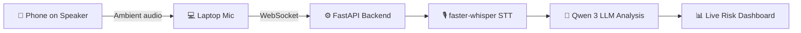
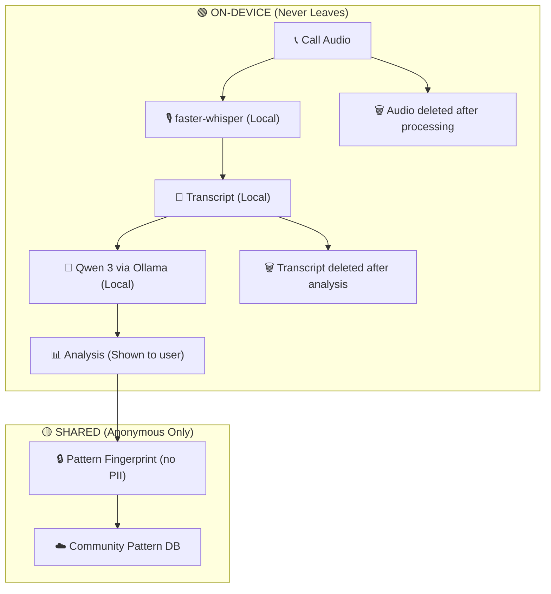
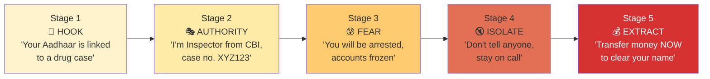

# AI Scam Call Interceptor — Complete Evaluation & Solutions

**Team:** Namit (Lead), Lakshay, Odil, Mayank, Palak, Ron  
**Context:** SIH 2026 — Internal Hackathon  
**Date:** 2026-07-24

---

## Executive Summary

Your project has **strong social impact** and **emotional appeal** — scam calls are a real, growing crisis in India. However, as currently proposed, it has **7 critical flaws** that experienced SIH judges will immediately identify. This document presents each flaw and its concrete, hackathon-feasible fix in one place.

> [!IMPORTANT]
> **Bottom line:** With the original proposal, this project scores **~4.5/10** and risks elimination in Round 2. With all fixes applied, it jumps to **~7.5/10** and becomes a genuine finale contender.

---

## The 7 Flaws & Their Fixes

---

### 🔴 FLAW #1: The Android Deal-Breaker

| Problem | Solution |
|:---|:---|
| Android has **blocked third-party call audio access** since Android 10. Your "real-time coaching during calls" is technically impossible. Your proposal acknowledges this but still claims live guidance — a direct contradiction judges will catch instantly. | **Pivot to a Web-Based Dashboard.** Phone on speakerphone → laptop mic captures ambient audio via browser `getUserMedia()` → WebSocket streams to FastAPI backend → faster-whisper + LLM analysis → live dashboard shows transcript + risk + coaching. |

**Architecture:**


**What to tell judges about production:**
> *"Our prototype uses browser audio capture. In production, we target: (1) Telecom operator integration at the network level, (2) OEM partnership with native dialer apps that have audio access, (3) WhatsApp/VoIP integration."*

**Judge Q:** *"Android blocks call audio. How does this work?"*  
**Your A:** *"We don't fight Android restrictions — we work around them honestly. Our demo uses speakerphone + web dashboard. Our production vision is telecom-level integration, like Airtel AI Shield."*

---

### 🔴 FLAW #2: Multi-Agent is Over-Engineering

| Problem | Solution |
|:---|:---|
| Your 5 "agents" are actually just sequential function calls — `whisper.transcribe()`, one LLM prompt, DB lookups, and score aggregation. Calling each step an "agent" is buzzword padding. | **Option A (Recommended):** Rename to "Multi-Stage AI Pipeline" — honest and still impressive. **Option B:** Add **real agent conflict resolution** to justify the "multi-agent" claim. |

**Real multi-agent behavior = conflict resolution:**
```
Manipulation Agent:  "FAKE AUTHORITY detected. Risk: HIGH (85%)"
Identity Agent:      "Number matches SBI official DB. Risk: LOW (10%)"

→ CONFLICT DETECTED

Decision Agent:      "Number IS genuinely SBI, but aggressive sales tactics 
                      detected. Risk: MEDIUM (45%). This is pushy marketing, 
                      not a scam."
```

Without conflict resolution, you're just running functions in sequence — not multi-agent.

**Judge Q:** *"Why 5 agents? Can't one LLM do all this?"*  
**Your A:** *"Our analysis modules run in parallel and can disagree. The Decision module resolves conflicts — for example, when a verified bank number uses manipulative language, the system correctly identifies it as aggressive marketing, not a scam."*

---

### 🔴 FLAW #3: Privacy Claims vs. Reality

| Problem | Solution |
|:---|:---|
| You claim "privacy-first" but your tech stack lists "LLM API depending on constraints" — sending transcripts to a cloud API is the **opposite** of privacy. "Anonymous pattern fingerprints" is undefined. | **Commit to 100% local inference** via Ollama (`qwen3:4b` = 2.5GB, runs on any laptop). Define "pattern fingerprint" as a structured JSON of detected tactics — no text, no audio, no PII. |

**Local LLM performance (all viable for demo):**

| Hardware | Model | Speed | Verdict |
|:---|:---|:---|:---|
| Laptop + GPU (GTX 1650+) | qwen3:4b | 40-70 tok/s | ✅ Excellent |
| Laptop CPU (i5/Ryzen 5) | qwen3:4b | 10-20 tok/s | ✅ Acceptable |
| Older laptop CPU | gemma2:2b | 15-25 tok/s | ✅ Good |

**Anonymous Pattern Fingerprint (precisely defined):**
```json
{
  "caller_number_hash": "sha256:a3f2...9b1c",
  "tactics_detected": {
    "fake_authority": true, "urgency": true,
    "fear_induction": true, "isolation": false,
    "financial_demand": true
  },
  "scam_category": "digital_arrest",
  "scam_stage_reached": "payment_demand",
  "risk_score": 94
}
```
Contains: ❌ No transcript ❌ No audio ❌ No PII ❌ No raw phone number

**Privacy Data Flow:**


**Judge Q:** *"You say privacy-first but use a cloud LLM API?"*  
**Your A:** *"We run Qwen 3 entirely locally via Ollama. Zero data leaves the device. We can demo this — there's no network call in our LLM pipeline."*

---

### 🟠 FLAW #4: Competing Against Giants

| Problem | Solution |
|:---|:---|
| Truecaller (500M users), Airtel AI Shield, Sanchar Saathi, ScamMukt all exist. You haven't articulated what you do that they don't. | **Stop competing on detection. Compete on EXPLANATION.** Your differentiator: psychological tactic breakdown + scam stage identification + actionable coaching. |

**The Pitch:**
> *"Truecaller says 'Spam Likely.' We say 'This is a Digital Arrest Scam — the caller is impersonating a CBI officer, using fear + urgency tactics, at the payment demand stage. Here's what to do.' Truecaller tells you there's a fire. We hand you the extinguisher."*

**Competitive Positioning:**

| Feature | Truecaller | Sanchar Saathi | Airtel Shield | **You** |
|:---|:---|:---|:---|:---|
| Number ID | ✅ | ❌ | ✅ | ✅ |
| Spam blocking | ✅ | ❌ | ✅ | ❌ |
| **Psychological tactic detection** | ❌ | ❌ | ❌ | **✅** |
| **Scam stage identification** | ❌ | ❌ | ❌ | **✅** |
| **Explainable risk reasoning** | ❌ | ❌ | ❌ | **✅** |
| **Real-time coaching** | ❌ | ❌ | ❌ | **✅** |
| **Privacy-first (local AI)** | ❌ | N/A | ❌ | **✅** |
| **Works offline** | ❌ | ❌ | ❌ | **✅** |

**Judge Q:** *"How is this different from Truecaller?"*  
**Your A:** *"Truecaller identifies spam numbers. We identify the psychological manipulation happening in the conversation — which tactics the scammer is using, what stage of the scam you're in, and exactly what to do next. We work even on first-time scam numbers that Truecaller has never seen."*

---

### 🟠 FLAW #5: Whisper ≠ Real-Time

| Problem | Solution |
|:---|:---|
| Whisper processes 30-second chunks — it's NOT a streaming model. On a laptop CPU with `whisper-small`, it takes 45 seconds for 30 seconds of audio. Hindi accuracy is poor on tiny models. | Use **`faster-whisper`** (CTranslate2, 4-5x faster) with **Silero VAD** (built-in) and INT8 quantization. Use `small` model for Hindi accuracy. Frame as "near-real-time." |

**Expected Latency:**

| Stage | Time |
|:---|:---|
| Audio buffer + VAD | 1-3 sec |
| faster-whisper (CPU, int8, small) | 0.5-1.5 sec |
| LLM analysis (Qwen 3, Ollama) | 3-6 sec |
| **Total per utterance** | **~5-10 sec** |

```python
from faster_whisper import WhisperModel

model = WhisperModel("small", device="cpu", compute_type="int8")

segments, info = model.transcribe(
    audio_chunk,
    language=None,        # Auto-detect Hindi/English/Hinglish
    vad_filter=True,      # Built-in Silero VAD
    vad_parameters=dict(min_silence_duration_ms=300)
)
```

> [!TIP]
> Use `whisper-small` not `tiny`. Hindi accuracy: tiny ~40% → small ~75%+. The extra 1s latency is worth it.

**Judge Q:** *"Is this real-time?"*  
**Your A:** *"Near-real-time with a 5-10 second processing window. This is intentional — we analyze complete utterances to improve manipulation detection accuracy."*

---

### 🟠 FLAW #6: No Real Data = No Proof

| Problem | Solution |
|:---|:---|
| No test dataset, no accuracy metrics, no false positive rate. Judges will ask for numbers and you'll have nothing. | Build a **50-scenario test dataset** from 4 real sources. Run a benchmark. Report precision, recall, F1 score. |

**Data Sources:**

| Source | What You Get |
|:---|:---|
| **TeleAntiFraud-28k** (HuggingFace) | 28,511 labeled speech-text fraud pairs, 307+ hours |
| **YouTube scam baiting videos** | Real Indian scam dialogue in Hindi/Hinglish |
| **I4C / PIB government advisories** | Exact scam scripts and vocabulary used |
| **Synthetic edge cases** | Legitimate bank calls that SHOULDN'T be flagged |

**50-Scenario Breakdown:**

| Category | Count |
|:---|:---|
| Digital Arrest Scam (Hindi + English) | 12 |
| Fake Bank / KYC Expiry | 6 |
| Lottery / Prize Scam | 4 |
| Fake Police / CBI | 5 |
| Tech Support Scam | 3 |
| **Legitimate Bank Calls (must NOT flag)** | **8** |
| **Legitimate Government Calls** | **4** |
| **Aggressive Sales (annoying, not scam)** | **4** |
| **Ambiguous Edge Cases** | **4** |

**Judge Q:** *"What's your accuracy?"*  
**Your A:** *"We tested on a 50-scenario dataset covering 7 scam types and 20 legitimate call scenarios. Our F1 score is X%, with a Y% false positive rate."* ← Even 75% F1 is impressive for a hackathon. Having ANY number puts you ahead of 90% of teams.

---

### 🟡 FLAW #7: Vague Novelty

| Problem | Solution |
|:---|:---|
| "Detects manipulation, not keywords" — every NLP model since BERT goes beyond keywords. This claim is not novel. | Build the **Indian Scam Psychology Taxonomy** (6 tactics based on Cialdini's framework + Indian patterns) and a **5-Stage Scam Progression Model.** |

**The 6-Tactic Taxonomy:**

| # | Tactic | Cialdini Principle | Indian Examples |
|:---|:---|:---|:---|
| 1 | **Authority Fabrication** | Authority | CBI, ED, Customs, "your bank", TRAI |
| 2 | **Urgency Engineering** | Scarcity | "10 minutes", "account frozen today" |
| 3 | **Fear Induction** | — | "arrest", "jail", "savings seized" |
| 4 | **Isolation Enforcement** | Commitment | "Don't tell anyone", "stay on call" |
| 5 | **Trust Manufacturing** | Liking + Social Proof | Fake case numbers, name-dropping |
| 6 | **Financial Extraction** | — | "Transfer now", OTP request, UPI |

**The 5-Stage Scam Progression Model:**



**Why this is genuinely novel:** No existing app maps calls to psychological stages. It's India-specific, academically grounded (Cialdini), and enables **intervention BEFORE the financial extraction stage.**

**Judge Q:** *"What's novel here?"*  
**Your A:** *"We built an India-specific scam psychology taxonomy with 6 manipulation tactics and a 5-stage progression model. Our system doesn't just detect scams — it identifies which stage of the scam the user is in, enabling intervention before financial loss."*

---

## What You're Doing RIGHT

| Strength | Why It Matters |
|:---|:---|
| 💚 **High social impact** | Real problem, real victims — judges care deeply |
| 💚 **Explainability focus** | "Here's WHY it's a scam" > "Spam Likely" |
| 💚 **Indian context** | Digital arrest, Aadhaar scams, TRAI impersonation — relevant and specific |
| 💚 **Privacy-first framing** | Strong differentiator IF you deliver on it with local inference |
| 💚 **Multi-stage analysis** | Analyzing scam progression is genuinely novel |

---

## 10 Questions Judges WILL Ask — With Prepared Answers

| # | Judge's Question | Your Answer |
|:---|:---|:---|
| 1 | *"How is this different from Truecaller?"* | "Truecaller says 'Spam Likely.' We explain which 6 psychological tactics are being used, what scam stage you're in, and what to do. We work on first-time scam numbers too." |
| 2 | *"Android blocks call audio. How does this work?"* | "We use a web dashboard that captures speakerphone audio via browser mic. Production path: telecom integration / OEM partnership." |
| 3 | *"Show me a live demo."* | Run a pre-recorded scam audio through the full pipeline → show live dashboard updating. |
| 4 | *"What about false positives?"* | "Our 50-scenario test set includes 20 legitimate calls. Our false positive rate is X%. We also resolve conflicts — a verified bank using pushy language is flagged as aggressive marketing, not scam." |
| 5 | *"You say privacy-first but need a cloud API?"* | "Everything runs locally via Ollama. Qwen 3 4B, 2.5GB, on-device. Zero network calls in our AI pipeline." |
| 6 | *"What's your accuracy?"* | "F1 score of X% on our 50-scenario benchmark with Y% false positive rate." |
| 7 | *"Who's the target user?"* | "Primarily 45+ age group — most vulnerable to scam calls, least likely to recognize manipulation tactics. Our coaching tips use simple, actionable language." |
| 8 | *"How does community intelligence work without leaking data?"* | "We share only an anonymous pattern fingerprint — a JSON of detected tactics, scam type, and a hashed number. No transcript, no audio, no PII." |
| 9 | *"What's the business model?"* | "B2B licensing to telecom operators (like Airtel AI Shield model) + potential government partnership with I4C/CERT-In for nationwide deployment." |
| 10 | *"Why multi-agent / multi-stage?"* | "Our analysis modules run in parallel and can disagree. The Decision module resolves conflicts with explainable reasoning — that's what makes this more than a simple pipeline." |

---

## Revised Team Roles

| Person | Role | Specific Deliverables |
|:---|:---|:---|
| **Namit** (Lead) | Integration + Decision Module | FastAPI app, WebSocket pipeline, Decision/Scoring, overall integration |
| **Lakshay** | Identity Verification | Phone parser, TRAI validator, trusted/scam DB, verification endpoints |
| **Odil** | Web Dashboard Frontend | Browser audio capture, WebSocket client, live risk display UI, demo polish |
| **Mayank** | Database + Community Intel | SQLite schema, seed data, pattern fingerprint system, test dataset |
| **Palak** | LLM + Manipulation Detection | Ollama setup, prompt engineering, taxonomy implementation, structured output |
| **Ron** | Speech-to-Text + Testing | faster-whisper pipeline, Silero VAD, Hindi/English, benchmarks, testing |

---

## 36-Hour Hackathon Timeline

| Hours | What | Who |
|:---|:---|:---|
| **0-2** | Git repo, folder structure, `requirements.txt`, Ollama install | All |
| **2-6** | Build individual modules (parallel) | Each person on their module |
| **6-8** | Integration checkpoint #1 — can modules talk? | Namit + all |
| **8-16** | Complete modules + unit tests | Everyone |
| **16-20** | Full pipeline: audio → STT → LLM → dashboard | Namit leads |
| **20-24** | Test dataset, benchmarks, bug fixes | Mayank + Ron |
| **24-28** | Demo polish — UI, demo script rehearsal | Odil + Palak |
| **28-32** | PPT, backup video demo | Namit + Palak |
| **32-36** | Practice presentation, judge Q&A prep | All |

---

## Final Scoring — Before vs. After Fixes

| Criterion | Before Fixes | After Fixes | Change |
|:---|:---|:---|:---|
| **Novelty** | 5/10 | 8/10 | Scam Psychology Taxonomy + Stage Model |
| **Technical Feasibility** | 4/10 | 7/10 | Web dashboard + local Ollama + faster-whisper |
| **Practicability** | 3/10 | 7/10 | No more Android impossibility claim |
| **Impact** | 7/10 | 8/10 | Explainability + coaching = real user value |
| **Presentation** | TBD | 8/10 | Prepared Q&A + honest framing + live demo |
| **Scalability** | 5/10 | 7/10 | Telecom integration path + community intel |
| **Overall** | **~4.5/10** | **~7.5/10** | **+3 points** |

---

## The Winning Formula

```
Web Dashboard (not Android app)
  + faster-whisper + Silero VAD (not raw Whisper)
  + Qwen 3 via Ollama (100% local, genuinely private)
  + Indian Scam Psychology Taxonomy (6 tactics, Cialdini-based)
  + 5-Stage Scam Progression Model (no competitor has this)
  + Explainable per-tactic analysis (not "Spam Likely")
  + 50-scenario benchmark with real metrics
  + Honest framing ("multi-stage pipeline", "near-real-time")
  = A project that can actually win 🏆
```

> The gap between a losing project and a winning one isn't the idea — it's the **honesty**, the **demo**, and the **depth**. Fix the flaws. Build the demo. Win.
