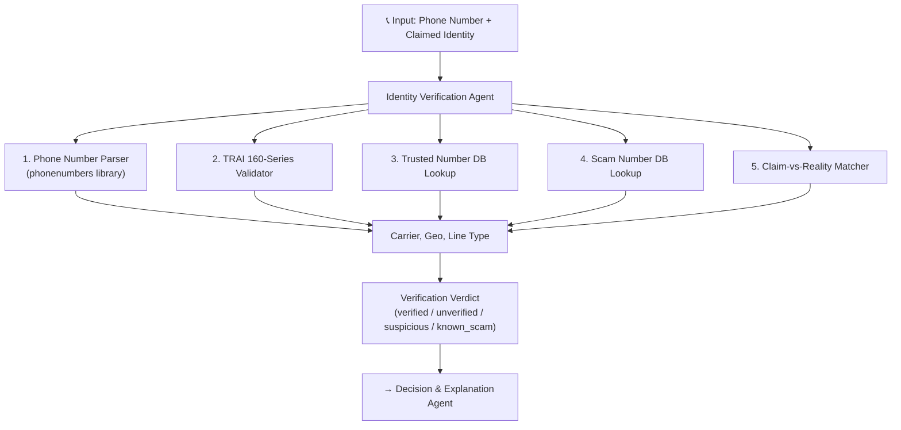
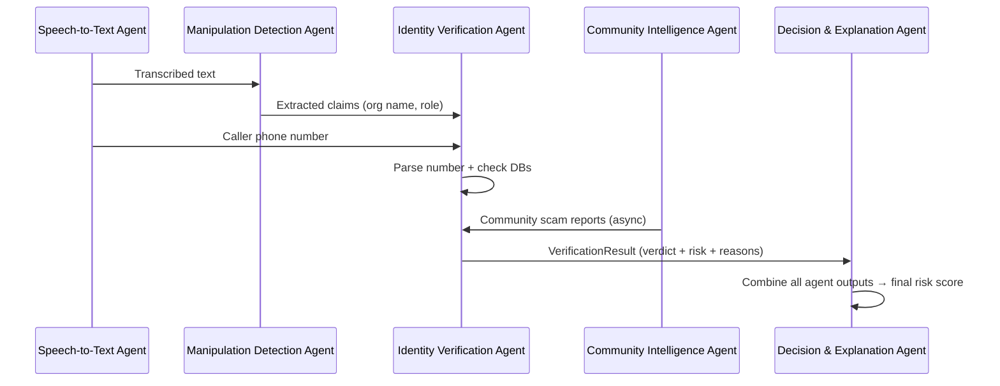

# Identity Verification Agent — Implementation Plan

**Author:** Lakshay  
**Project:** AI Scam Call Interceptor / Psychology Analyzer  
**Component:** Identity Verification Agent  
**Date:** 2026-07-24

---

## Overview

The Identity Verification Agent is responsible for verifying whether a caller's **claimed identity** (e.g., "I'm calling from SBI", "This is the Cyber Crime Department") matches reality. It cross-references claims against trusted databases, known scam number lists, and TRAI numbering rules to produce a **verification verdict** that feeds into the Decision & Explanation Agent's final risk score.

This agent does **not** analyze speech psychology (that's the Manipulation Detection Agent's job). It focuses purely on **who the caller claims to be** vs. **who they actually are**.

---

## User Review Required

> [!IMPORTANT]
> **Tech Stack Decisions:** The plan uses **FastAPI + SQLite + phonenumbers** as the core stack, aligning with the project-wide tech choices. If the team has settled on a different database (e.g., ChromaDB), let me know and I'll adapt.

> [!IMPORTANT]
> **No Live Call Audio Access:** Since Android restricts third-party call audio access, this agent receives its input as **structured text** (caller's phone number + claims extracted by the Speech Recognition / Manipulation Detection agents). This is consistent with the hackathon prototype approach.

> [!WARNING]
> **No Official Government API Exists:** There is no official TRAI/RBI/SBI API to verify if a phone number belongs to a specific institution. Our verification relies on: (1) a curated local database of known official numbers, (2) TRAI 160-series format rules, (3) community-reported scam numbers, and (4) the `phonenumbers` library for carrier/geo validation. This is a realistic and honest approach for a hackathon.

---

## Open Questions

1. **Integration Contract:** How will other agents send data to this agent? I'm proposing a simple FastAPI endpoint that accepts JSON. Does this align with what Namit (integration lead) envisions?
2. **Seed Data:** Should we pre-populate the database with known official numbers for major banks (SBI, HDFC, ICICI, etc.) and government agencies? I recommend **yes** for demo impact.
3. **Community Intelligence Overlap:** The Community Intelligence Agent (separate component) also tracks scam patterns. Should this agent query the community DB directly, or should the Decision Agent merge results? I'm proposing **direct query** for speed.

---

## Proposed Architecture



---

## Proposed Changes

### Project Structure

```
identity_verification/
├── __init__.py
├── agent.py                 # Main agent orchestrator
├── config.py                # Configuration & constants
├── models.py                # Pydantic data models
├── routers/
│   └── verify.py            # FastAPI router (API endpoints)
├── services/
│   ├── phone_parser.py      # Phone number parsing & validation
│   ├── trai_validator.py    # TRAI 160-series format checks
│   ├── trusted_db.py        # Trusted organization number lookups
│   ├── scam_db.py           # Known scam number lookups
│   └── claim_matcher.py     # Cross-references claim vs all evidence
├── database/
│   ├── db.py                # SQLite connection & init
│   ├── seed_data.py         # Pre-populated official numbers & scam numbers
│   └── scam_interceptor.db  # SQLite database file (auto-created)
├── tests/
│   ├── test_phone_parser.py
│   ├── test_trai_validator.py
│   ├── test_trusted_db.py
│   ├── test_claim_matcher.py
│   └── test_api.py
├── requirements.txt
└── README.md
```

---

### Core Components

#### [NEW] `identity_verification/models.py`
Pydantic models defining the input/output contracts:

- **`VerificationRequest`** — Input from other agents:
  - `phone_number: str` — Caller's phone number (any format)
  - `claimed_identity: str | None` — e.g., "State Bank of India", "Cyber Crime Department"
  - `claimed_role: str | None` — e.g., "bank officer", "police inspector"
  - `call_transcript_snippet: str | None` — Relevant text for context

- **`PhoneAnalysis`** — Phone number metadata:
  - `normalized_number: str` — E.164 format
  - `country_code: str`
  - `carrier: str | None`
  - `region: str | None`
  - `line_type: str` — mobile / fixed_line / voip / toll_free / unknown
  - `is_valid: bool`

- **`VerificationResult`** — Output to Decision Agent:
  - `verdict: str` — One of: `verified`, `unverified`, `suspicious`, `known_scam`
  - `confidence: float` — 0.0 to 1.0
  - `risk_score: float` — 0.0 to 100.0 (contribution to overall scam score)
  - `reasons: list[str]` — Human-readable explanations
  - `phone_analysis: PhoneAnalysis`
  - `matched_organization: str | None` — If number matched a trusted org
  - `scam_reports_count: int` — How many times this number was reported

---

#### [NEW] `identity_verification/services/phone_parser.py`
Uses the `phonenumbers` library (Google's libphonenumber) to:
- Parse any phone number format into E.164
- Extract carrier name, geographic region
- Detect line type (mobile vs VoIP vs toll-free)
- Flag VoIP numbers as higher risk (commonly used by scammers)

---

#### [NEW] `identity_verification/services/trai_validator.py`
Implements TRAI 160-series verification rules:
- **`1600XXXXXXX`** → Government entity (legitimate if claiming to be government)
- **`1601XXXXXXX`** → Private financial institution (legitimate if claiming to be a bank)
- **Regular 10-digit mobile number** claiming to be a bank → **Suspicious** (real banks use 160-series or registered toll-free numbers)
- Maps telecom circle codes and service provider codes from the 160-series format

---

#### [NEW] `identity_verification/services/trusted_db.py`
Manages the **Trusted Organizations Database**:
- Stores verified phone numbers for major Indian banks, government agencies, and telecom providers
- Supports fuzzy name matching (e.g., "SBI" → "State Bank of India")
- Returns organization details if a number is found in the trusted list

---

#### [NEW] `identity_verification/services/scam_db.py`
Manages the **Scam Numbers Database**:
- Stores phone numbers reported as scam (community-contributed)
- Tracks report count, first/last report timestamps
- Supports adding new reports (from Community Intelligence Agent)
- Returns scam history for a given number

---

#### [NEW] `identity_verification/services/claim_matcher.py`
The **brain** of the agent — combines all evidence:

| Scenario | Verdict | Risk Contribution |
|:---|:---|:---|
| Number found in trusted DB + claim matches | `verified` | 0-10 |
| Number is 160-series + claim matches category | `verified` | 5-15 |
| Number not in any DB, no claim made | `unverified` | 30-40 |
| Number is regular mobile, claims to be bank/govt | `suspicious` | 60-80 |
| Number is VoIP, claims to be bank/govt | `suspicious` | 70-85 |
| Number found in scam DB | `known_scam` | 85-100 |
| Number in scam DB + high report count | `known_scam` | 95-100 |

---

#### [NEW] `identity_verification/database/seed_data.py`
Pre-populated data for hackathon demo:

**Trusted Numbers (sample):**
| Organization | Numbers | Category |
|:---|:---|:---|
| SBI | 1800-11-2211, 1800-425-3800 | Bank |
| HDFC Bank | 1800-22-1006 | Bank |
| ICICI Bank | 1800-1080 | Bank |
| Cyber Crime Helpline | 1930 | Government |
| TRAI | 1800-11-4000 | Government |
| RBI | 14448 | Government |

**Known Scam Patterns (sample):**
- Numbers frequently reported on cybercrime.gov.in forums
- Common VoIP prefixes used in scam operations

---

#### [NEW] `identity_verification/routers/verify.py`
FastAPI endpoints:

| Method | Endpoint | Purpose |
|:---|:---|:---|
| `POST` | `/api/v1/verify` | Main verification endpoint — accepts `VerificationRequest`, returns `VerificationResult` |
| `POST` | `/api/v1/report-scam` | Report a number as scam (for Community Intelligence integration) |
| `GET` | `/api/v1/lookup/{phone_number}` | Quick lookup — returns phone analysis without claim matching |
| `GET` | `/api/v1/trusted-orgs` | List all trusted organizations in the database |
| `GET` | `/api/v1/health` | Health check endpoint |

---

#### [NEW] `identity_verification/agent.py`
Main agent orchestrator that:
1. Receives a `VerificationRequest`
2. Runs all services in parallel (phone parsing, TRAI check, DB lookups)
3. Feeds results into the claim matcher
4. Returns a structured `VerificationResult`

Can be called directly (as a Python function) or via the FastAPI endpoint — designed to work both as a standalone microservice and as a module imported by the multi-agent framework (LangGraph/CrewAI).

---

#### [NEW] `identity_verification/config.py`
Configuration constants:
- Database path
- Risk score thresholds
- VoIP risk weight
- Trusted number categories
- API rate limits

---

#### [NEW] `identity_verification/tests/`
Test suite covering:
- Phone number parsing edge cases (Indian numbers, international, invalid)
- TRAI 160-series validation
- Trusted DB lookups (match, no-match, fuzzy match)
- Scam DB operations (add, query, count)
- Claim matching logic (all scenarios from the table above)
- API endpoint integration tests

---

#### [NEW] `identity_verification/requirements.txt`
```
fastapi>=0.104.0
uvicorn>=0.24.0
phonenumbers>=8.13.0
pydantic>=2.5.0
aiosqlite>=0.19.0
pytest>=7.4.0
httpx>=0.25.0
```

---

#### [NEW] `identity_verification/README.md`
Documentation covering:
- What this agent does
- How to run it
- API reference
- How it integrates with other agents
- Database schema
- Example requests/responses

---

## Verification Plan

### Automated Tests
```bash
cd identity_verification
pip install -r requirements.txt
pytest tests/ -v
```

### Manual Verification
1. **Start the server:** `uvicorn identity_verification.agent:app --reload`
2. **Test with known SBI number:**
   ```bash
   curl -X POST http://localhost:8000/api/v1/verify \
     -H "Content-Type: application/json" \
     -d '{"phone_number": "18001122211", "claimed_identity": "State Bank of India"}'
   ```
   → Expected: `verdict: "verified"`, low risk score

3. **Test with random mobile number claiming to be SBI:**
   ```bash
   curl -X POST http://localhost:8000/api/v1/verify \
     -H "Content-Type: application/json" \
     -d '{"phone_number": "+919876543210", "claimed_identity": "State Bank of India"}'
   ```
   → Expected: `verdict: "suspicious"`, high risk score

4. **Test with known scam number:**
   → Expected: `verdict: "known_scam"`, very high risk score

5. **Demo the full flow** with the team using simulated scam call transcripts

---

## Integration with Other Agents



---

## Timeline Estimate

| Task | Time |
|:---|:---|
| Project setup + models + config | 30 min |
| Phone parser service | 30 min |
| TRAI validator service | 30 min |
| Database setup + seed data | 45 min |
| Trusted DB + Scam DB services | 45 min |
| Claim matcher (core logic) | 45 min |
| FastAPI endpoints | 30 min |
| Tests | 45 min |
| README + integration docs | 20 min |
| **Total** | **~5.5 hours** |
